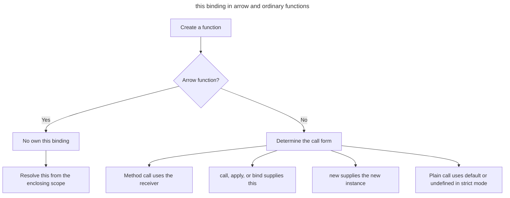

## TL;DR

Arrow functions provide concise syntax and capture `this` and `arguments` from their surrounding scope. They work well for array transformations and for callbacks created inside a method or constructor that need the surrounding receiver. An arrow used directly as an object method does **not** receive the object as `this`; use a regular method when the caller's receiver should determine `this`. Arrow functions also cannot be called with `new`, do not have a `prototype`, and cannot be generators.

```js live
const numbers = [1, 2, 3];
const doubled = numbers.map((n) => n * 2);
console.log(doubled); // [2, 4, 6]
```

---

## How `this` is selected

The key semantic distinction is that an arrow function closes over `this`, while an ordinary function receives `this` from how it is invoked.



That lexical behavior makes arrows useful for callbacks that should retain an enclosing method's receiver, but unsuitable as constructors or dynamically bound methods.

## Use case for the new arrow => function syntax

### Simplifying syntax

Arrow functions provide a more concise way to write functions. This is especially useful for short functions or callbacks.

```js live
// Traditional function
const add = function (a, b) {
  return a + b;
};

// Arrow function
const anotherAdd = (a, b) => a + b;

console.log(add(2, 3)); // Output: 5
console.log(anotherAdd(2, 3)); // Output: 5
```

### Lexical `this` binding

Arrow functions do not have their own `this` context. Instead, they capture `this` from the surrounding scope. This is particularly useful for a callback created inside a regular method or constructor. It is not a general replacement for method syntax: an arrow assigned directly as an object property does not receive that object as its receiver.

```js live
function Timer() {
  this.seconds = 0;
  this.increment = () => {
    this.seconds++; // 'this.seconds' is inherited from the outer scope
    console.log(this.seconds);
  };
}

const timer = new Timer();
const increment = timer.increment;
increment(); // 1
increment(); // 2
```

In the example above, `increment` is called without `timer` as its receiver, but the arrow function still uses the `this` value captured by the `Timer` constructor. A traditional function would lose that context when detached this way unless it was explicitly bound.

### Using arrow functions in array methods

Arrow functions are often used in array methods like `map`, `filter`, and `reduce` for cleaner and more readable code.

```js live
const numbers = [1, 2, 3, 4, 5];

// Traditional function
const doubledTraditional = numbers.map(function (n) {
  return n * 2;
});

// Arrow function
const doubled = numbers.map((n) => n * 2);

console.log(doubled); // [2, 4, 6, 8, 10]
```

### Event handlers

An arrow callback created inside a class constructor or method can retain that surrounding instance's `this` value.

```js live
class Button {
  constructor() {
    this.count = 0;
    this.button = document.createElement('button');
    this.button.innerText = 'Click me';
    this.button.addEventListener(
      'click',
      () => {
        this.count++;
        console.log('count:', this.count);
      },
      { once: true },
    );
    document.body.appendChild(this.button);
  }
}

const myButton = new Button();
myButton.button.click(); // count: 1
myButton.button.remove();
```

### Other differences from regular functions

- Arrow functions capture `arguments`, `super`, and `new.target` from an enclosing non-arrow function instead of defining their own bindings.
- They are not constructors, so `new arrowFunction()` throws `TypeError`, and they do not have a `prototype` property.
- They cannot be generators and therefore cannot use `yield` in their bodies.
- A single expression can be returned implicitly; an object-literal result must be wrapped in parentheses, as in `items.map((item) => ({ id: item.id }))`.

## Further reading

- [MDN Web Docs: Arrow functions](https://developer.mozilla.org/en-US/docs/Web/JavaScript/Reference/Functions/Arrow_functions)
- [JavaScript.info: Arrow functions revisited](https://javascript.info/arrow-functions)
- [Eloquent JavaScript: Functions](https://eloquentjavascript.net/03_functions.html)
