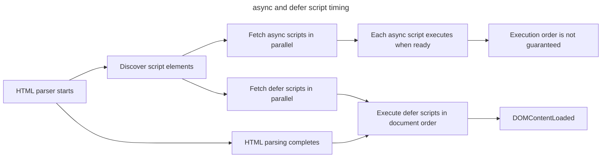

## TL;DR

All of these ways (`<script>`, `<script async>`, and `<script defer>`) are used to load and execute JavaScript files in an HTML document, but they differ in how the browser handles loading and execution of the script:

- `<script>` is the default way of including JavaScript. The browser blocks HTML parsing while the script is being downloaded and executed. The browser will not continue rendering the page until the script has finished executing.
- `<script async>` downloads the script asynchronously, in parallel with parsing the HTML. Executes the script as soon as it is available, potentially interrupting the HTML parsing. Multiple `<script async>` tags do not wait for each other and execute in no particular order.
- `<script defer>` downloads the script asynchronously, in parallel with parsing the HTML. However, the execution of the script is deferred until HTML parsing is complete, in the order they appear in the HTML.

Here's a table summarizing the 4 ways of loading `<script>`s in an HTML document. Modern apps almost always use modules, which deserve their own row.

| Feature | `<script>` | `<script async>` | `<script defer>` | `<script type="module">` |
| --- | --- | --- | --- | --- |
| Parsing behavior | Blocks HTML parsing | Downloads in parallel; execution still blocks parsing | Downloads in parallel; execution deferred until after parsing | Downloads in parallel; execution deferred until after parsing |
| Execution order | In order of appearance | Not guaranteed | In order of appearance | In order of appearance, with each script's `import` dependencies resolved first |
| DOM state at execution | Only earlier markup is parsed | Depends on download timing | Document parsing is complete | Document parsing is complete |

---

## Loading and execution timing

Both attributes allow fetching alongside HTML parsing, but `async` executes as soon as it is ready while `defer` waits for parsing and preserves document order.



An `async` script can execute before or after parsing completes and does not delay `DOMContentLoaded` once that event is otherwise ready.

## What `<script>` tags are for

`<script>` tags are used to include JavaScript on a web page. The `async` and `defer` attributes are used to change how/when the loading and execution of the script happens.

## `<script>`

For normal `<script>` tags without any `async` or `defer`, when they are encountered, HTML parsing is blocked, the script is fetched and executed immediately. HTML parsing resumes after the script is executed. This can block rendering of the page if the script is large.

Use `<script>` for critical scripts that the page relies on to render properly.

```html
<!doctype html>
<html>
  <head>
    <title>Regular Script</title>
  </head>
  <body>
    <!-- Content before the script -->
    <h1>Regular Script Example</h1>
    <p>This content will be rendered before the script executes.</p>

    <!-- Regular script -->
    <script src="regular.js"></script>

    <!-- Content after the script -->
    <p>This content will be rendered after the script executes.</p>
  </body>
</html>
```

## `<script async>`

In `<script async>`, the browser downloads the script file asynchronously (in parallel with HTML parsing) and executes it as soon as it is available (potentially before HTML parsing completes). The script will not necessarily be executed in the order in which it appears in the HTML document. This can improve perceived performance because the browser doesn't wait for the script to download before continuing to render the page.

Use `<script async>` when the script is independent of any other scripts on the page, for example, analytics and ads scripts.

```html
<!doctype html>
<html>
  <head>
    <title>Async Script</title>
  </head>
  <body>
    <!-- Content before the script -->
    <h1>Async Script Example</h1>
    <p>This content will be rendered before the async script executes.</p>

    <!-- Async script -->
    <script async src="async.js"></script>

    <!-- Content after the script -->
    <p>
      This content may be rendered before or after the async script executes.
    </p>
  </body>
</html>
```

## `<script defer>`

Similar to `<script async>`, `<script defer>` downloads in parallel with HTML parsing, but executes after parsing and before `DOMContentLoaded`. Deferred classic scripts preserve document order. They also wait for stylesheets that block scripts, which can indirectly delay `DOMContentLoaded`.

If a script relies on a fully-parsed DOM, the `defer` attribute will be useful in ensuring that the HTML is fully parsed before executing.

```html
<!doctype html>
<html>
  <head>
    <title>Deferred Script</title>
  </head>
  <body>
    <!-- Content before the script -->
    <h1>Deferred Script Example</h1>
    <p>This content will be rendered before the deferred script executes.</p>

    <!-- Deferred script -->
    <script defer src="deferred.js"></script>

    <!-- Content after the script -->
    <p>This content will be rendered before the deferred script executes.</p>
  </body>
</html>
```

## `<script type="module">`

Module scripts are the standard entry point for projects built with Vite (and many other modern bundlers). Next.js doesn't always emit `type="module"` for its own runtime, but most application code authored as ES modules ends up running through one of these tags. They behave like `defer` scripts with two important additions: dependencies declared with `import` are loaded and executed in the right order, and module code is strict by default.

```html
<script type="module" src="/src/main.js"></script>
```

Behavior:

- **Parsing**: deferred. HTML parsing continues; the script does not block.
- **Execution**: runs after the document has finished parsing. Across multiple `<script type="module">` tags in the same document, execution follows document order, but each script's `import` dependencies are resolved and executed first.
- **DOM ready**: the DOM is parsed before the module runs.
- **Strict mode**: enforced automatically; no `'use strict'` directive needed.
- **CORS**: module scripts are always fetched with CORS, so the server must send `Access-Control-Allow-Origin` for cross-origin loads. The `crossorigin` attribute itself is not required for the module to load — it only controls whether credentials (cookies, HTTP auth) are sent on cross-origin requests (`crossorigin` or `crossorigin="anonymous"` omits them; `crossorigin="use-credentials"` sends them). Adding it is still recommended for explicit credentials handling and for full error details in `error` event handlers.

Use `<script type="module">` for new front-end code. If you have an independent module-script entry point and document order does not matter, combine with `async`:

```html
<script async type="module" src="/analytics-module.js"></script>
```

## Which to use: a decision matrix

| Script type | Use for |
| --- | --- |
| `<script>` (no attrs) | Critical inline scripts that must run synchronously before the next HTML element parses. |
| `<script async>` | Independent third-party scripts where order does not matter (analytics, ads, monitoring beacons). |
| `<script defer>` | Classic (non-module) app scripts where order matters and the DOM should be ready. |
| `<script type="module">` | Native ES module entry points and bundler output that preserves modules. |
| `<script async type="module">` | Module scripts where order does not matter. Most apps want default module behavior instead. |

## How build tools load scripts

It also helps to know what the tools you use actually generate.

- Build tools may emit module scripts, classic deferred scripts, preload hints, or injected runtime loaders. Inspect the generated HTML instead of assuming a framework maps directly to one native attribute.
- Independent third-party scripts are often candidates for `async`; use `defer` when document order or `DOMContentLoaded` timing matters. Follow a vendor's integration constraints and measure the effect either way.

## Common bugs from the wrong attribute choice

- **Independent script loaded with `defer` unnecessarily.** A deferred script runs before `DOMContentLoaded` and preserves order with other deferred scripts. If neither property is needed, `async` may avoid delaying `DOMContentLoaded`; verify that the script has no ordering dependency first.
- **App entry as `async` script.** If `app.js` and `vendor.js` are loaded with `async`, they can execute in any order. `app.js` may run before `vendor.js` finishes, which throws `ReferenceError` for the missing globals. Use `defer` (or modules) for app scripts.
- **`document.write` inside a `defer` or `async` script.** Browsers ignore `document.write()` calls from async or deferred scripts with a console warning: "A call to document.write() from an asynchronously-loaded external script was ignored." The script would need to be a regular blocking `<script>` for the call to take effect, though `document.write` should be avoided in any new code.
- **Module script in a `<script>` tag without `type="module"`.** Top-level `import` statements throw `SyntaxError`. Either set `type="module"` or use a bundler.
- **Cross-origin module served without CORS headers.** Module scripts are always fetched with CORS, so a cross-origin URL like `<script type="module" src="https://cdn.example.com/lib.js">` will fail to load if the server doesn't send `Access-Control-Allow-Origin`. The fix is on the server side — adding `crossorigin` to the tag does not bypass this requirement (though it is still recommended for better error reporting and explicit credentials handling).

## Notes

- The `async` attribute should be used for scripts that are not critical to the initial rendering of the page and do not depend on each other, while the `defer` attribute should be used for scripts that depend on or are depended on by another script.
- `defer` has no effect on inline scripts, and `async` has no effect on inline classic scripts. `async` can affect an inline module script because its dependency graph still has to be fetched.
- `<script>`s with `defer` or `async` that contain `document.write()` will be ignored with a message like "A call to `document.write()` from an asynchronously-loaded external script was ignored".
- Even though `async` and `defer` help to make script downloading asynchronous, the scripts are still eventually executed on the main thread. If these scripts are computationally intensive, it can result in laggy/frozen UI. [Partytown](https://partytown.qwik.dev/) is a library that helps relocate script executions into a [web worker](https://developer.mozilla.org/en-US/docs/Web/API/Web_Workers_API) and off the [main thread](https://developer.mozilla.org/en-US/docs/Glossary/Main_thread), which is great for third-party scripts where you do not have control over the code.

## Further reading

- [`<script>`: The Script element | MDN](https://developer.mozilla.org/en-US/docs/Web/HTML/Element/script#defer)
- [async vs defer attributes](https://www.growingwiththeweb.com/2014/02/async-vs-defer-attributes.html)
