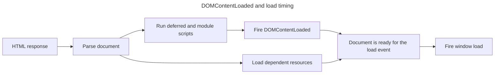

## TL;DR

`DOMContentLoaded` fires after the HTML has been parsed and deferred and module scripts have executed. It does not directly wait for images, subframes, or stylesheets, although a blocking stylesheet can delay a script and therefore indirectly delay `DOMContentLoaded`. The window `load` event waits for the document and its dependent resources, apart from resources loaded lazily.

```js
document.addEventListener('DOMContentLoaded', function () {
  console.log('DOM fully loaded and parsed');
});

window.addEventListener('load', function () {
  console.log('Page fully loaded');
});
```

---

## Document readiness timeline

`DOMContentLoaded` marks completion of DOM construction and deferred script execution; `load` waits longer for dependent resources such as images and stylesheets.



A slow image can delay `load` without delaying `DOMContentLoaded`; asynchronous scripts have separate timing rules.

## Difference between document `load` event and document `DOMContentLoaded` event

### `DOMContentLoaded` event

The `DOMContentLoaded` event fires after the initial HTML has been parsed and deferred and module scripts have run. It does not directly wait for images, subframes, or stylesheets. However, deferred scripts wait for blocking stylesheets, and `DOMContentLoaded` waits for those scripts, so stylesheets can delay it indirectly.

```js
document.addEventListener('DOMContentLoaded', function () {
  console.log('DOM fully loaded and parsed');
});
```

### `load` event

The window `load` event fires when the document and its dependent resources, such as stylesheets, eagerly loaded images, scripts, and subframes, have finished loading. Lazily loaded resources do not hold it up. Use it only for work that actually requires those resources, such as reading intrinsic image dimensions.

```js
window.addEventListener('load', function () {
  console.log('Page fully loaded');
});
```

### Key differences

- **Timing**: `DOMContentLoaded` fires earlier than `load`. `DOMContentLoaded` occurs after the HTML is fully parsed, while `load` waits for all resources to be loaded.
- **Use cases**: Use `DOMContentLoaded` for tasks that only require the DOM to be ready, such as attaching event listeners or manipulating the DOM. Use `load` for tasks that depend on all resources being fully loaded, such as image-dependent layout calculations.

## Further reading

- [MDN Web Docs: DOMContentLoaded](https://developer.mozilla.org/en-US/docs/Web/API/Document/DOMContentLoaded_event)
- [MDN Web Docs: load event](https://developer.mozilla.org/en-US/docs/Web/API/Window/load_event)
- [JavaScript.info: DOMContentLoaded, load, beforeunload, unload](https://javascript.info/onload-ondomcontentloaded)
