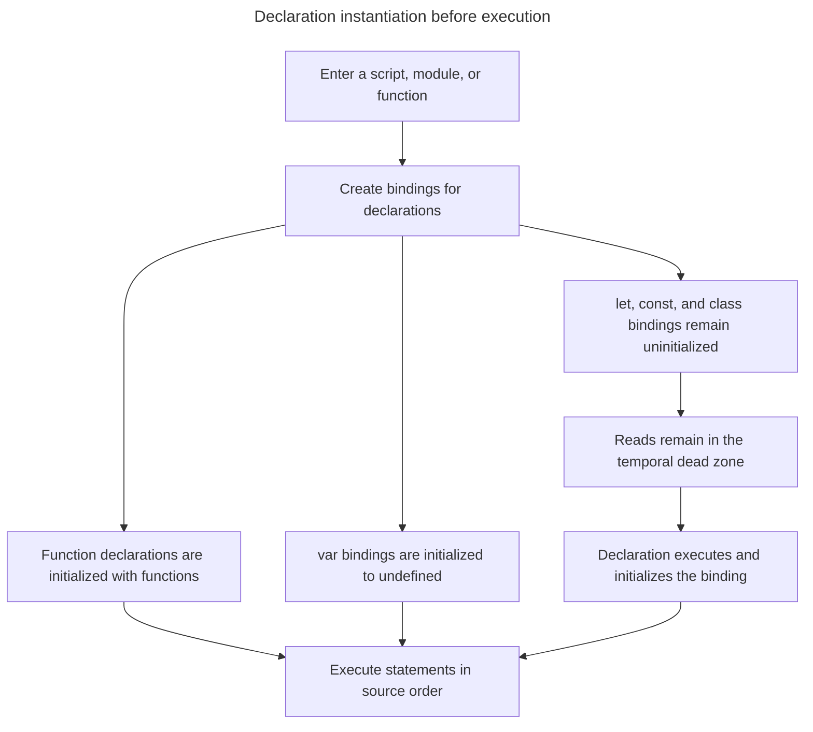

## TL;DR

"Hoisting" is informal shorthand for how JavaScript creates and initializes bindings while it instantiates a scope, before evaluating that scope's statements. The engine does not move source text.

- **Variable declarations (`var`)**: The binding is created and initialized to `undefined` before statements run. Its assignment still happens at the declaration's source location.
- **Variable declarations (`let` and `const`)**: The binding is created but remains uninitialized in the temporal dead zone (TDZ) until evaluation reaches the declaration. Accessing it earlier throws `ReferenceError`.
- **Function expressions (`var`)**: The `var` binding initially contains `undefined`; the function is created only when the expression is evaluated.
- **Function declarations (`function`)**: The binding is initialized with the function during scope setup, so it can be called before its declaration appears in source order.
- **Class declarations (`class`)**: The binding exists during scope setup but remains in the TDZ until the class declaration is evaluated.
- **Import declarations (`import`)**: Imported bindings are linked before module evaluation. Dependencies normally evaluate before the importing module's body, although cycles can expose an uninitialized binding.

The following behavior summarizes the result of accessing the variables before they are declared.

| Declaration                    | Accessing before declaration |
| ------------------------------ | ---------------------------- |
| `var foo`                      | `undefined`                  |
| `let foo`                      | `ReferenceError`             |
| `const foo`                    | `ReferenceError`             |
| `class Foo`                    | `ReferenceError`             |
| `var foo = function() { ... }` | `undefined`                  |
| `function foo() { ... }`       | Normal                       |
| `import`                       | Normal, except some cycles   |

---

## Declaration setup and execution

“Hoisting” describes the observable result of declaration instantiation before statements execute; the source text is not rearranged.



This model explains why different declarations are all commonly called “hoisted” even though early access produces different results.

## Hoisting

Hoisting is a term used to explain the behavior of declarations in JavaScript code.

Before evaluating statements in a scope, JavaScript instantiates its declarations and creates their bindings. A `var` binding is initialized to `undefined` at that point; an initializer or later assignment still runs at its original source location. No declaration is physically moved.

Let's explain with a few code samples. Note that the code for these examples should be executed within a module scope instead of being entered line by line into a REPL like the browser console.

### Hoisting of variables declared using `var`

Hoisting is visible here: even though `foo` is declared and initialized after the first `console.log()`, the first `console.log()` prints `undefined`.

```js live
console.log(foo); // undefined
var foo = 1;
console.log(foo); // 1
```

You can visualize the code as:

```js live
var foo;
console.log(foo); // undefined
foo = 1;
console.log(foo); // 1
```

### Hoisting of variables declared using `let`, `const`, and `class`

Bindings declared via `let`, `const`, and `class` are also created during scope instantiation. Unlike `var` and function declarations, they remain uninitialized, and accessing them before evaluation reaches the declaration throws `ReferenceError`. This interval is the temporal dead zone.

```js live
y; // ReferenceError: Cannot access 'y' before initialization
let y = 'local';
```

```js live
z; // ReferenceError: Cannot access 'z' before initialization
const z = 'local';
```

```js live
Foo; // ReferenceError: Cannot access 'Foo' before initialization

class Foo {
  constructor() {}
}
```

### Hoisting of function expressions

A function expression is a function assigned to a variable binding. When the binding uses `var`, scope setup initializes it to `undefined`; the function object is not created until evaluation reaches the expression.

```js live
console.log(bar); // undefined
bar(); // TypeError: bar is not a function

var bar = function () {
  console.log('BARRRR');
};
```

Arrow functions are function expressions too, so the same rule applies — only the binding is hoisted, and its TDZ behavior follows the declaration keyword (`var` initializes to `undefined`, `let` and `const` remain in the TDZ until their declaration runs).

```js live
console.log(baz); // undefined
var baz = () => 'arrow';
console.log(baz()); // 'arrow'
```

### Hoisting of function declarations

Function declarations use the `function` keyword. Unlike function expressions, their bindings are initialized with the function during scope setup, so they can be called before their declarations appear in source order.

```js live
console.log(foo); // [Function: foo]
foo(); // 'FOOOOO'

function foo() {
  console.log('FOOOOO');
}
```

The same applies to generator functions (`function*`), async functions (`async function`), and async generator functions (`async function*`).

### Hoisting of `import` statements

Import declarations are hoisted. The identifiers the imports introduce are available in the entire module scope, and their side effects are produced before the rest of the module's code runs.

```js
foo.doSomething(); // Works normally.

import foo from './modules/foo';
```

## Under the hood

In reality, JavaScript creates all variables in the current scope before it even tries to execute the code. Variables created using the `var` keyword will have the value of `undefined`, whereas variables created using the `let` and `const` keywords will be marked as `<value unavailable>`. Thus, accessing them will cause a `ReferenceError`, preventing you from accessing them before initialization.

In the ECMAScript specification, `let` and `const` declarations are [explained as below](https://tc39.es/ecma262/#sec-let-and-const-declarations):

> The variables are created when their containing Environment Record is instantiated but may not be accessed in any way until the variable's LexicalBinding is evaluated.

However, this statement is [a little different for the `var` keyword](https://tc39.es/ecma262/#sec-variable-statement):

> Var variables are created when their containing Environment Record is instantiated and are initialized to `undefined` when created.

MDN groups hoisting into four observable behaviors, which map to the declaration kinds covered above:

1. **Value hoisting** — the value is usable before the declaration. Applies to function declarations.
2. **Declaration hoisting** — the binding is usable before the declaration but reads `undefined`. Applies to `var`.
3. **Scope tainting** — the binding exists from the top of the scope but any access throws (the TDZ). Applies to `let`, `const`, and `class`.
4. **Side effects** — the declaration's side effects run before the rest of the module evaluates. Applies to `import`.

## Modern practices

In practice, modern codebases avoid using `var` and use `let` and `const` exclusively. It is recommended to declare and initialize your variables and import statements at the top of the containing scope/module to eliminate the mental overhead of tracking when a variable can be used.

ESLint is a static code analyzer that can find violations of such cases with the following rules:

- [`no-use-before-define`](https://eslint.org/docs/latest/rules/no-use-before-define): Warns when an identifier is referenced before its declaration appears in source.
- [`no-undef`](https://eslint.org/docs/latest/rules/no-undef): Warns when an identifier is referenced without being declared anywhere in scope.

## Additional examples

The examples below cover hoisting behaviors that are less obvious from the summary table and that commonly cause confusion.

### Function declaration compared with function expression

```js live
console.log(declared());
console.log(expressed());

function declared() {
  return 'function declaration';
}

var expressed = function () {
  return 'function expression';
};
```

- `declared()` returns `'function declaration'`. The `declared` binding is initialized with the function before statement evaluation begins.
- `expressed()` throws `TypeError: expressed is not a function`. Scope setup initializes the `var expressed` binding to `undefined`, but the assignment of the function expression happens at its source location. Calling `undefined()` produces the `TypeError`.

### `var` in a `for` loop with `setTimeout`

```js live
for (var i = 0; i < 3; i++) {
  setTimeout(() => console.log(i), 0);
}
// Output: 3, 3, 3
```

`var i` is function-scoped rather than block-scoped, so all three callbacks close over the same binding. The loop increments `i` to `3` before any `setTimeout` callback runs, because macrotasks run after the current synchronous code completes. Each callback then reads the current value of the shared `i`, which is `3`.

Two fixes:

- Replace `var` with `let`. `let` is block-scoped, so each iteration creates a fresh binding that the callback closes over.
- Wrap the body in an IIFE that captures the current value as a parameter: `(i => setTimeout(() => console.log(i), 0))(i)`. This was the pre-ES6 workaround.

### `var` escapes block scope

```js live
if (true) {
  var a = 1;
  let b = 2;
}
console.log(a); // 1
console.log(b); // ReferenceError: b is not defined
```

`var` is scoped to the nearest function or script, not to the enclosing block. Its binding therefore belongs to the containing function or script scope, which is why `a` is still visible after the `if`. `let` and `const` are block-scoped, so `b` only exists inside the block.

### Redeclaration

```js
var x = 1;
var x = 2; // OK — x is now 2

let y = 1;
let y = 2; // SyntaxError: Identifier 'y' has already been declared
```

`var` allows the same name to be redeclared in the same scope; the second declaration is a no-op and only the assignment runs. `let`, `const`, and `class` throw `SyntaxError` if the same name is declared twice in the same scope. Like hoisting, this is resolved statically before execution — duplicate lexical declarations are an _early error_ detected during parsing, so no code runs at all.

### Class declarations

```js live
console.log(typeof Foo);

class Foo {}
```

This throws `ReferenceError: Cannot access 'Foo' before initialization`.

The `Foo` binding is created when the enclosing block is instantiated, but it remains in the Temporal Dead Zone until the `class` declaration is evaluated. Any access before that point throws, including `typeof`.

This behavior can be confused with "classes are not hoisted". The two statements are observably different:

- If `Foo` were not hoisted, `typeof Foo` would return `'undefined'` (the behavior for truly undeclared identifiers).
- Because `Foo` is hoisted but uninitialized, `typeof Foo` throws.

The distinction also matters for `extends` clauses, which are evaluated at class declaration time. `class A extends B {}` throws if `B` is hoisted but still in the TDZ at that point.

### `typeof` and the Temporal Dead Zone

```js live
console.log(typeof undeclaredVariable); // 'undefined'
console.log(typeof someLet); // ReferenceError
let someLet = 1;
```

`typeof` does not throw when applied to an identifier that has no declaration anywhere in scope — it returns the string `'undefined'`. However, `typeof` does throw when applied to an identifier that is declared but still in the Temporal Dead Zone. The binding exists, and reading it (which `typeof` must do) triggers the TDZ error.

This distinguishes "undeclared" (no binding in any enclosing scope) from "declared but uninitialized" (binding exists, initialization has not yet occurred).

### Shared names across `var` and function declarations

```js live
function outer() {
  console.log(inner);
  inner();

  function inner() {
    console.log('inner called');
  }

  var inner = 'overwritten';
}

outer();
// Output:
// [Function: inner]
// inner called
```

Two behaviors combine here:

1. Scope instantiation processes both `var inner` and the `function inner` declaration before `outer`'s statements run.
2. When a `var` declaration and a function declaration share a name in the same scope, the function declaration takes precedence during initialization. `inner` is initialized with the function object rather than `undefined`.

The `var inner = 'overwritten'` assignment takes effect only after the two `console.log` calls, so those calls observe the function. A `console.log(inner)` after the assignment would print `'overwritten'`.

A `let` or `const` declaration in the same scope as a `var` of the same name produces a `SyntaxError` at parse time, before any code runs.

## Common misconceptions

The following statements appear frequently in explanations of hoisting, including in material generated by large language models, but are incorrect or imprecise:

1. **Classes are not hoisted.** Class bindings are created during scope instantiation but remain in the Temporal Dead Zone until the declaration is evaluated. That is observably different from having no binding — most notably, `typeof` throws on a class in the TDZ but returns `'undefined'` for a truly undeclared identifier.
2. **`var` is hoisted; `let` and `const` are not.** All three bindings are created before statement evaluation. They differ in initialization: `var` is initialized to `undefined` immediately, while `let` and `const` remain uninitialized in the TDZ until their declarations are evaluated.
3. **`typeof` never throws on undeclared variables.** `typeof` is safe for identifiers that have no declaration anywhere in scope, but it throws in the TDZ. The `typeof x === 'undefined'` guard is only safe if `x` is not declared anywhere in the enclosing scope.
4. **Function declarations are hoisted; function expressions are not.** A declaration's binding is initialized with its function during scope setup. An expression creates its function only when that expression is evaluated: a `var` binding contains `undefined` before then, while a `let` or `const` binding remains in the TDZ.

## Further reading

- [Hoisting | MDN](https://developer.mozilla.org/en-US/docs/Glossary/Hoisting)
- [ECMA-262 §14.2.6 Block Runtime Semantics: Evaluation](https://tc39.es/ecma262/#sec-block-runtime-semantics-evaluation)
- [Temporal Dead Zone | MDN](https://developer.mozilla.org/en-US/docs/Web/JavaScript/Reference/Statements/let#temporal_dead_zone_tdz)
- [What is Hoisting in JavaScript?](https://www.freecodecamp.org/news/what-is-hoisting-in-javascript)
