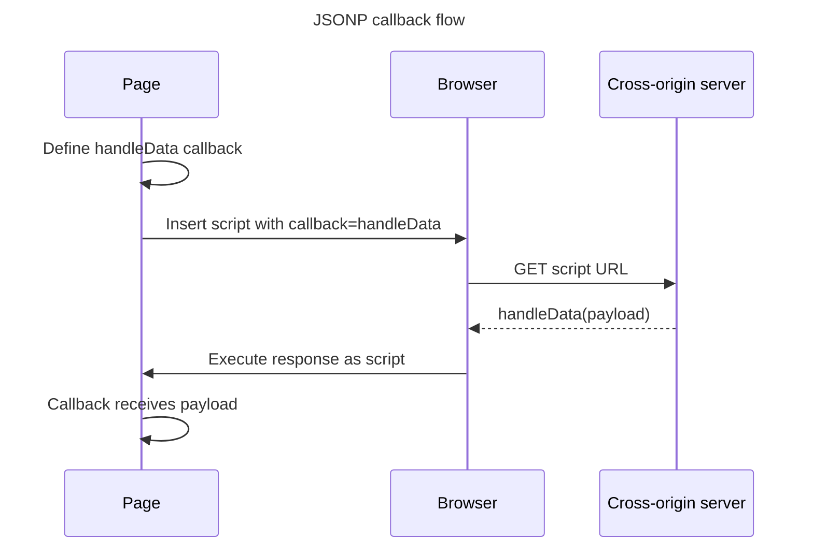

## TL;DR

JSONP (JSON with Padding) is a legacy technique for reading cross-origin data by loading it as a classic `<script>`, a resource type the same-origin policy permits pages to embed. The server returns executable JavaScript that calls a predefined callback with the data. Unlike `XMLHttpRequest` or `fetch()`, JSONP only performs script-style GET requests and requires complete trust in the responding server. CORS is the modern alternative.

---

## JSONP request flow

JSONP exploits the browser's ability to load a cross-origin classic script, so the response is executable JavaScript rather than JSON returned to `fetch()`.



Because the remote response executes with the page's privileges, JSONP requires complete trust in the endpoint and should be replaced by CORS-enabled requests in modern code.

## How JSONP works (and how it's not really Ajax)

### What is JSONP?

JSONP stands for JSON with Padding. The same-origin policy generally restricts scripts from reading cross-origin responses, but classic scripts may be embedded from another origin. JSONP uses that embedding exception to deliver data as executable code.

### How JSONP works

1. **Dynamic script tag creation**: A `<script>` tag is dynamically created and its `src` attribute is set to the URL of the data source, including a callback function name as a query parameter.
2. **Server response**: The server responds with a script that calls the callback function, passing the data as an argument.
3. **Callback execution**: The browser executes the script, invoking the callback function with the data.

Here is a simple example:

```html
<!doctype html>
<html>
  <head>
    <title>JSONP Example</title>
    <script>
      function handleResponse(data) {
        console.log(data);
      }

      function fetchData() {
        var script = document.createElement('script');
        script.src = 'https://example.com/data?callback=handleResponse';
        document.body.appendChild(script);
      }
    </script>
  </head>
  <body>
    <button onclick="fetchData()">Fetch Data</button>
  </body>
</html>
```

In this example, when the button is clicked, a `<script>` tag is created with the `src` attribute set to `https://example.com/data?callback=handleResponse`. The server at `example.com` responds with a script like this:

```js
handleResponse({
  name: 'John',
  age: 30,
});
```

### How JSONP is different from Ajax

- **Transport mechanism**: JSONP uses the `<script>` tag to fetch data, whereas Ajax uses the XMLHttpRequest object.
- **Request type**: JSONP is limited to GET requests, while Ajax can use various HTTP methods like GET, POST, PUT, DELETE, etc.
- **Same-origin policy**: JSONP can bypass the same-origin policy, while Ajax requests are subject to it unless CORS (Cross-Origin Resource Sharing) is used.
- **Error handling**: JSONP has limited error handling capabilities compared to Ajax.

### Limitations of JSONP

- **Security risks**: The response executes with the embedding page's privileges. A compromised or malicious endpoint can run arbitrary JavaScript, not merely return data.
- **Limited to GET requests**: JSONP cannot be used for POST requests or other HTTP methods.
- **Error handling**: JSONP lacks robust error handling mechanisms compared to Ajax.

## Further reading

- [W3Schools: JSONP](https://www.w3schools.com/js/js_json_jsonp.asp)
- [Same-origin policy](https://developer.mozilla.org/en-US/docs/Web/Security/Same-origin_policy)
- [Cross-Origin Resource Sharing (CORS)](https://developer.mozilla.org/en-US/docs/Web/HTTP/Guides/CORS)
