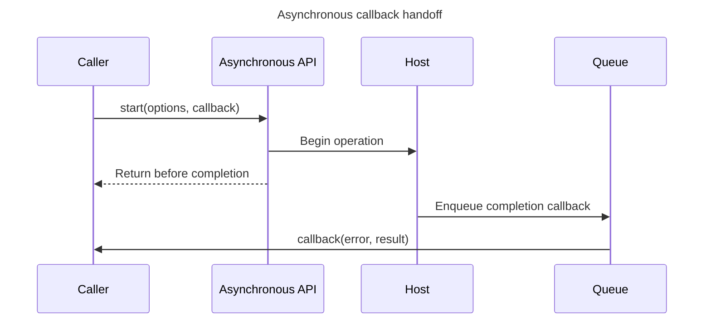

## TL;DR

A callback is a function passed to another API to invoke later or during its operation. In asynchronous APIs, the contract must define when and how often it runs, how errors are reported, and how to cancel or unsubscribe. Scheduling a callback lets the current stack continue, but the callback's own JavaScript still occupies the thread when it eventually runs.

```js live
function fetchData(callback) {
  setTimeout(() => {
    const data = { name: 'John', age: 30 };
    callback(data);
  }, 1000);
}

fetchData((data) => {
  console.log(data);
});
```

---

## Callback handoff

The caller supplies behavior now, but the host invokes it only after the asynchronous operation produces an outcome and the runtime can schedule the callback.



The callback must handle its error and result contract explicitly, and throwing later from that callback does not travel back to the original call site.

## What is a callback function?

A callback function is a function that is passed as an argument to another function and is executed after some operation has been completed. This is particularly useful in asynchronous programming, where operations like network requests, file I/O, or timers need to be handled without blocking the main execution thread.

### Synchronous vs. asynchronous callbacks

- **Synchronous callbacks** run before the receiving function returns, as with an `Array.prototype.map()` callback.
- **Asynchronous callbacks** run in a later task or API-defined turn, as with timers and many Node.js I/O callbacks. The operation can wait without blocking JavaScript, but a CPU-heavy callback can still block its thread.

### Example of a synchronous callback

```js live
function greet(name, callback) {
  console.log('Hello ' + name);
  callback();
}

function sayGoodbye() {
  console.log('Goodbye!');
}

greet('Alice', sayGoodbye);
// Output:
// Hello Alice
// Goodbye!
```

### Example of an asynchronous callback

```js live
function fetchData(callback) {
  setTimeout(() => {
    const data = { name: 'John', age: 30 };
    callback(data);
  }, 1000);
}

fetchData((data) => {
  console.log(data);
});
// Output after 1 second:
// { name: 'John', age: 30 }
```

### Common use cases

- **Network requests**: Fetching data from an API
- **File I/O**: Reading or writing files
- **Timers**: Delaying execution using `setTimeout` or `setInterval`
- **Event handling**: Responding to user actions like clicks or key presses

### Handling errors in callbacks

When dealing with asynchronous operations, it's important to handle errors properly. A common pattern is to use the first argument of the callback function to pass an error object, if any.

```js live
function fetchData(callback) {
  // assume asynchronous operation to fetch data
  const { data, error } = { data: { name: 'John', age: 30 }, error: null };
  callback(error, data);
}

fetchData((error, data) => {
  if (error) {
    console.error('An error occurred:', error);
  } else {
    console.log(data);
  }
});
```

The error-first convention is common in Node.js callback APIs, but DOM event listeners use event objects and different APIs define different contracts. Guard against callbacks that can fire repeatedly, and retain the same function reference when cleanup requires it:

```js
function handleResize() {
  layoutDashboard();
}

window.addEventListener('resize', handleResize);

// When the dashboard is disposed:
window.removeEventListener('resize', handleResize);
```

Use Promises for a single future result when they make composition and error propagation clearer. Use callbacks or event subscriptions for repeated notifications, streaming, or APIs that already expose that contract.

## Further reading

- [MDN Web Docs: Callback function](https://developer.mozilla.org/en-US/docs/Glossary/Callback_function)
- [JavaScript.info: Callbacks](https://javascript.info/callbacks)
- [Node.js: Asynchronous programming and callbacks](https://nodejs.org/en/learn/asynchronous-work/javascript-asynchronous-programming-and-callbacks)
