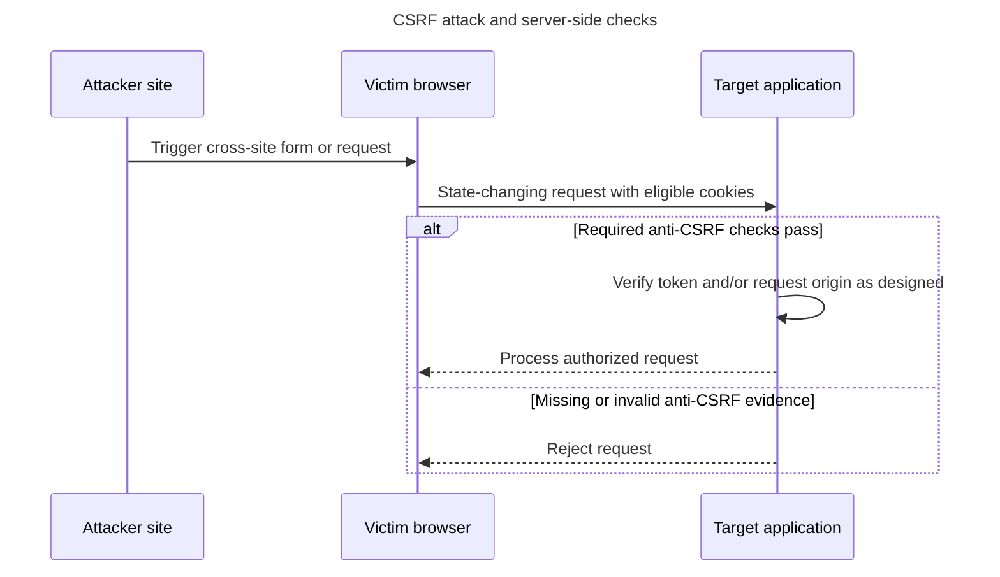

## TL;DR

Cross-Site Request Forgery (CSRF) tricks a browser into sending an unwanted state-changing request with ambient credentials such as cookies. Defend with `SameSite` cookies, an unpredictable CSRF token or custom-header pattern for relevant requests, and server-side `Origin`/`Referer` or Fetch Metadata checks as additional layers. CORS alone is not a CSRF defense because simple cross-origin requests and HTML forms can still be sent.

---

## How ambient credentials enable CSRF

A malicious page can cause the victim's browser to send a state-changing request, and eligible cookies may accompany it automatically.



`SameSite` cookies reduce exposure but should be combined with an appropriate token or origin check for cookie-authenticated state changes.

## Cross-Site Request Forgery (CSRF) and its mitigation techniques

### What is CSRF?

Cross-Site Request Forgery (CSRF) is a type of attack that occurs when a malicious website causes a user's browser to perform an unwanted action on a different site where the user is authenticated. This can lead to unauthorized actions such as changing account details, making purchases, or other actions that the user did not intend to perform.

### How does CSRF work?

1. **User authentication**: The user logs into a trusted website (e.g., a banking site) and receives an authentication cookie.
2. **Malicious site**: The user visits a malicious website while still logged into the trusted site.
3. **Unwanted request**: The malicious site contains code that makes a request to the trusted site, using the user's authentication cookie to perform actions on behalf of the user.

### Mitigation techniques

#### Anti-CSRF tokens

One of the most effective ways to prevent CSRF attacks is by using anti-CSRF tokens. These tokens are unique and unpredictable values that are generated by the server and included in forms or requests. The server then validates the token to ensure the request is legitimate.

```html
<form method="POST" action="/update-profile">
  <input type="hidden" name="csrf_token" value="unique_token_value" />
  <!-- other form fields -->
  <button type="submit">Update Profile</button>
</form>
```

On the server side, the token is validated to ensure it matches the expected value.

#### SameSite cookies

The `SameSite` attribute on cookies can help mitigate CSRF attacks by restricting how cookies are sent with cross-site requests. The `SameSite` attribute can be set to `Strict`, `Lax`, or `None`.

```http
Set-Cookie: sessionId=abc123; SameSite=Strict
```

- `Strict`: Cookies are only sent in a first-party context and not with requests initiated by third-party websites.
- `Lax`: Cookies are not sent on normal cross-site subrequests (e.g., loading images), but are sent when a user navigates to the URL from an external site (e.g., following a link).
- `None`: Cookies are sent in cross-site contexts and must also use `Secure`.

#### Origin and Fetch Metadata checks

For state-changing requests, a server can reject unexpected `Origin` or `Referer` values and use Fetch Metadata headers such as `Sec-Fetch-Site` as defense in depth. These checks should complement, not replace, tokens or an appropriate `SameSite` policy.

```http
if (req.get('Origin') !== 'https://app.example.com') {
  return res.sendStatus(403);
}
```

CORS controls whether JavaScript can read a cross-origin response and whether non-simple requests pass preflight. It does not prevent a browser from sending all cross-origin requests, so an allowlist is not sufficient CSRF protection.

### Further reading

- [OWASP CSRF Prevention Cheat Sheet](https://cheatsheetseries.owasp.org/cheatsheets/Cross-Site_Request_Forgery_Prevention_Cheat_Sheet.html)
- [MDN Web Docs: SameSite cookies](https://developer.mozilla.org/en-US/docs/Web/HTTP/Reference/Headers/Set-Cookie#samesitesamesite-value)
- [MDN Web Docs: Cross-Origin Resource Sharing (CORS)](https://developer.mozilla.org/en-US/docs/Web/HTTP/Guides/CORS)
