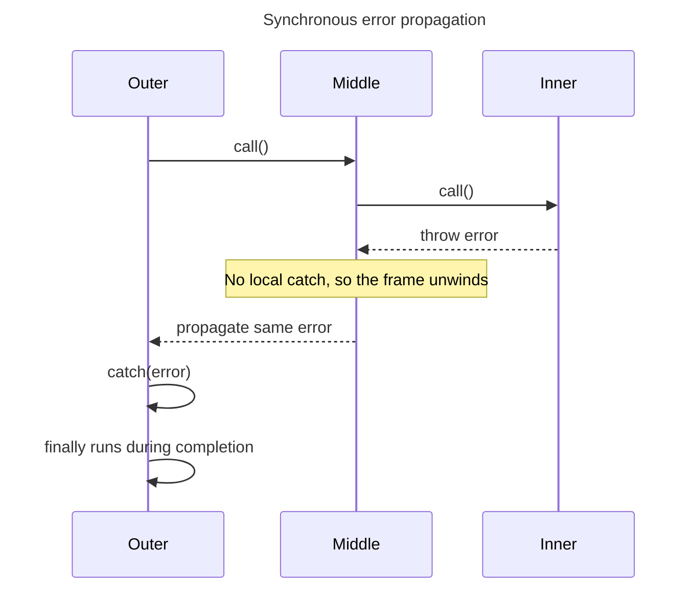

## TL;DR

Synchronous exceptions propagate up the current call stack until a matching `catch` handles them. Promise rejections propagate through the returned Promise chain until a rejection handler handles them. A `try...catch` around code that merely schedules a timer or callback cannot catch an exception thrown later on a different stack; the asynchronous API must report the failure through a Promise, error-first callback, or its own error event.

```js live
function a() {
  throw new Error('An error occurred');
}

function b() {
  a();
}

try {
  b();
} catch (e) {
  console.error(e.message); // Outputs: An error occurred
}
```

---

## Stack unwinding

A synchronous throw exits the current function and unwinds callers until it finds a matching `catch` or reaches the host.



Promise rejections propagate through promise chains rather than the synchronous call stack, but the same principle applies: handle the error at the layer that can recover or add useful context.

## Error propagation in JavaScript

Error propagation in JavaScript is a mechanism that allows errors to be passed up the call stack until they are caught and handled. This is crucial for debugging and ensuring that errors do not cause the entire application to crash unexpectedly.

### How errors propagate

When an error occurs in a function, it can either be caught and handled within that function or propagate up the call stack to the calling function. If the calling function does not handle the error, it continues to propagate up the stack until it reaches the global scope, potentially causing the program to terminate.

### Using `try...catch` blocks

To handle errors and prevent them from propagating further, you can use `try...catch` blocks. Here is an example:

```js live
function a() {
  throw new Error('An error occurred');
}

function b() {
  a();
}

try {
  b();
} catch (e) {
  console.error(e.message); // Outputs: An error occurred
}
```

In this example, the error thrown in function `a` propagates to function `b`, and then to the `try...catch` block where it is finally caught and handled.

### Propagation with asynchronous code

Error propagation works differently with asynchronous code, such as promises and `async/await`. For promises, you can use `.catch()` to handle errors:

```js live
function a() {
  return Promise.reject(new Error('An error occurred'));
}

function b() {
  return a();
}

b().catch((e) => {
  console.error(e.message); // Outputs: An error occurred
});
```

For `async/await`, you can use `try...catch` blocks:

```js live
async function a() {
  throw new Error('An error occurred');
}

async function b() {
  await a();
}

(async () => {
  try {
    await b();
  } catch (e) {
    console.error(e.message); // Outputs: An error occurred
  }
})();
```

The `await` is important because it connects the rejection to the surrounding `try...catch`. Compare that with a later timer callback:

```js
try {
  setTimeout(() => {
    throw new Error('Runs on a later call stack');
  }, 0);
} catch (error) {
  // This never runs.
}
```

Design the asynchronous operation so the error has an explicit channel:

```js live
function delay(ms) {
  return new Promise((resolve) => setTimeout(resolve, ms));
}

async function runJob() {
  await delay(0);
  throw new Error('Job failed');
}

runJob().catch((error) => console.error(error.message)); // Job failed
```

### Best practices

- Handle an error where you can recover, retry, translate it into a domain result, or add useful context. Otherwise let it propagate.
- Return or `await` Promises. Starting a Promise and discarding it disconnects its rejection from the caller.
- When wrapping an error, preserve it with `new Error(message, { cause: error })`.
- Add a final error boundary at request, job, or process edges for logging and cleanup. Do not expose stacks or sensitive internal details to users.

## Further reading

- [MDN Web Docs: Error handling](https://developer.mozilla.org/en-US/docs/Web/JavaScript/Guide/Control_flow_and_error_handling#exception_handling_statements)
- [JavaScript.info: Error handling, "try...catch"](https://javascript.info/try-catch)
- [Node.js Documentation: Errors](https://nodejs.org/api/errors.html)
