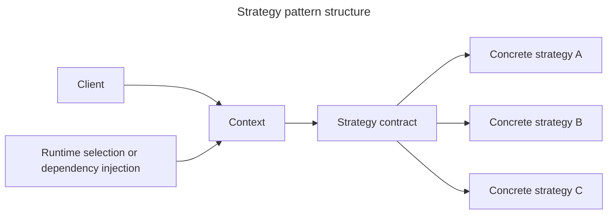

## TL;DR

The Strategy pattern defines interchangeable implementations behind the same contract, letting the caller select behavior without accumulating a large conditional. JavaScript strategies can be plain functions or objects; separate classes are not required. It is useful when multiple algorithms are real extension points, such as pricing or retry policies. Prefer a simple `if` or `switch` when there are only a few stable branches—the pattern otherwise adds indirection without useful flexibility.

```js live
class Context {
  constructor(strategy) {
    this.strategy = strategy;
  }

  executeStrategy(data) {
    return this.strategy.doAlgorithm(data);
  }
}

class ConcreteStrategyA {
  doAlgorithm(data) {
    // Implementation of algorithm A
    return 'Algorithm A was run on ' + data;
  }
}

class ConcreteStrategyB {
  doAlgorithm(data) {
    // Implementation of algorithm B
    return 'Algorithm B was run on ' + data;
  }
}

// Usage
const context = new Context(new ConcreteStrategyA());
context.executeStrategy('someData'); // Output: Algorithm A was run on someData
```

---

## Swappable behavior behind one contract

The context delegates one varying part of its work to a strategy selected by configuration or runtime conditions.



The pattern is useful when the algorithms share a stable contract and should vary independently from the code that orchestrates them.

## The Strategy pattern

### Definition

The Strategy pattern is a behavioral design pattern that enables selecting an algorithm's behavior at runtime. It defines a family of algorithms, encapsulates each one, and makes them interchangeable. This pattern allows the algorithm to vary independently from the clients that use it.

### Components

1. **Context**: Maintains a reference to a `Strategy` object and is configured with a `ConcreteStrategy` object.
2. **Strategy**: An interface common to all supported algorithms. The `Context` uses this interface to call the algorithm defined by a `ConcreteStrategy`.
3. **ConcreteStrategy**: Implements the `Strategy` interface to provide a specific algorithm.

### Example

Consider a scenario where you have different sorting algorithms and you want to switch between them without changing the client code.

```js live
// Strategy interface
class Strategy {
  doAlgorithm(data) {
    throw new Error('This method should be overridden!');
  }
}

// ConcreteStrategyA
class ConcreteStrategyA extends Strategy {
  doAlgorithm(data) {
    return data.sort((a, b) => a - b); // Example: ascending sort
  }
}

// ConcreteStrategyB
class ConcreteStrategyB extends Strategy {
  doAlgorithm(data) {
    return data.sort((a, b) => b - a); // Example: descending sort
  }
}

// Context
class Context {
  constructor(strategy) {
    this.strategy = strategy;
  }

  setStrategy(strategy) {
    this.strategy = strategy;
  }

  executeStrategy(data) {
    return this.strategy.doAlgorithm(data);
  }
}

// Usage
const data = [3, 1, 4, 1, 5, 9];
const context = new Context(new ConcreteStrategyA());
console.log(context.executeStrategy([...data])); // Output: [1, 1, 3, 4, 5, 9]

context.setStrategy(new ConcreteStrategyB());
console.log(context.executeStrategy([...data])); // Output: [9, 5, 4, 3, 1, 1]
```

### Benefits

- **Flexibility**: You can change the algorithm at runtime.
- **Maintainability**: Adding new strategies does not affect existing code.
- **Encapsulation**: Each algorithm is encapsulated in its own class.

### Drawbacks

- **Overhead**: Increased number of classes and objects.
- **Complexity**: Can make the system more complex if not used judiciously.

### JavaScript implementation with functions

A strategy map often fits JavaScript better than one class per option:

```js live
const shippingStrategies = {
  standard: ({ weight }) => 5 + weight * 0.5,
  express: ({ weight }) => 12 + weight * 1.25,
  pickup: () => 0,
};

function quoteShipping(method, parcel) {
  const strategy = shippingStrategies[method];
  if (!strategy) throw new RangeError(`Unsupported method: ${method}`);
  return strategy(parcel);
}

console.log(quoteShipping('express', { weight: 4 })); // 17
```

Every strategy receives the same input shape and returns the same kind of result. Validate that contract at the boundary. If strategies perform asynchronous work, also define common error, cancellation, and timeout behavior so callers can switch implementations safely.

## Further reading

- [Strategy pattern on Wikipedia](https://en.wikipedia.org/wiki/Strategy_pattern)
- [Refactoring Guru: Strategy pattern](https://refactoring.guru/design-patterns/strategy)
- [MDN Web Docs: JavaScript classes](https://developer.mozilla.org/en-US/docs/Web/JavaScript/Reference/Classes)
