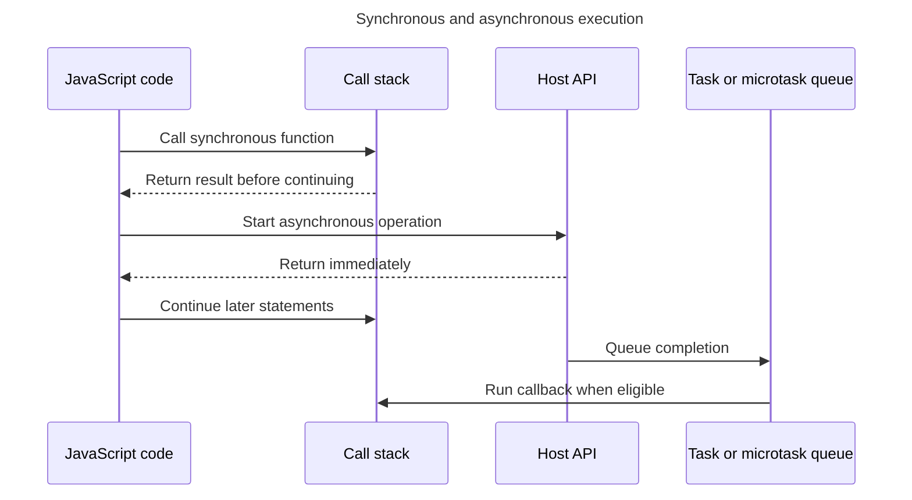

## TL;DR

Synchronous code runs to completion on the current call stack before later statements can run. Asynchronous APIs arrange for a result to be handled later through a callback, promise, or event, allowing the current stack to finish while the host waits for I/O or a timer. Asynchronous does not mean “runs on another thread”: an `async` function runs synchronously until its first suspension point, and CPU-heavy JavaScript still blocks its thread.

```js live
function sum(a, b) {
  console.log('Inside sum function');
  return a + b;
}

const result = sum(2, 3); // The program waits for sum() to complete before assigning the result
console.log('Result: ', result); // Output: 5
```

Asynchronous APIs commonly expose callbacks, promises, or events. Once the operation can make progress, its continuation is scheduled according to the host's event loop. This works especially well for I/O such as network and database requests; CPU-intensive work must instead be split up or moved to a worker to keep a browser UI responsive.

```js live
function fetchData(callback) {
  setTimeout(() => {
    const data = { name: 'John', age: 30 };
    callback(data); // Calling the callback function with data
  }, 2000); // Simulating a 2-second delay
}

console.log('Fetching data...');

fetchData((data) => {
  console.log(data); // Output: { name: 'John', age: 30 } (after 2 seconds)
});

console.log('Call made to fetch data'); // This will print before the data is fetched
```

---

## Execution over time

A synchronous call keeps control until it returns, whereas an asynchronous API can start host work and return before that work completes.



An `async` function still runs synchronously until its first suspension point; its promise represents the eventual completion.

## Synchronous vs asynchronous functions

In JavaScript, synchronous and asynchronous functions are fundamental to understanding how code execution is managed, especially when handling operations like I/O tasks, API calls, and other time-consuming processes.

## Synchronous functions

Synchronous functions execute in a sequential order, one after the other. Each operation must wait for the previous one to complete before moving on to the next.

- Synchronous code occupies the current JavaScript thread until the current operation finishes.
- It follows a strict sequence, executing instructions line by line.
- Synchronous functions are easier to understand and debug since the flow is predictable.

### Synchronous function examples

1. **Reading files synchronously**: When reading a file from the file system using the synchronous `readFileSync` method from the `fs` module in Node.js, the program execution is blocked until the entire file is read. This can cause performance issues, especially for large files or when reading multiple files sequentially.

   ```js
   const fs = require('fs');
   const data = fs.readFileSync('large-file.txt', 'utf8');
   console.log(data); // Execution is blocked until the file is read.
   console.log('End of the program');
   ```

2. **Looping over large datasets**: Iterating over a large array or dataset synchronously can freeze the user interface or browser tab until the operation completes, leading to an unresponsive application.

   ```js live
   const largeArray = new Array(1_000_000).fill(0);
   // Blocks the main thread until the million operations are completed.
   const result = largeArray.map((num) => num * 2);
   console.log(result);
   ```

## Asynchronous functions and APIs

Asynchronous APIs let the host wait for operations such as network or file I/O without keeping the JavaScript stack occupied. Their JavaScript callbacks still run on an event-loop thread and can block it if they do expensive work.

- It enables concurrency while waiting for host operations, often improving responsiveness.
- Declaring a function `async` does not move its body to another thread. It executes immediately until an `await` actually suspends it.
- Asynchronous functions are commonly used for tasks like network requests, file I/O, and timers.

### Asynchronous function examples

1. **Network requests**: Making network requests, such as fetching data from an API or sending data to a server, is typically done asynchronously. This allows the application to remain responsive while waiting for the response, preventing the user interface from freezing.

   ```js live
   console.log('Start of the program'); // This will be printed first as program starts here

   fetch('https://jsonplaceholder.typicode.com/todos/1')
     .then((response) => {
       if (!response.ok) throw new Error(`HTTP ${response.status}`);
       return response.json();
     })
     .then((data) => {
       console.log(data);
       /** Process the data without blocking the main thread
        *  and printed at the end if fetch call succeeds
        */
     })
     .catch((error) => console.error(error));

   console.log('End of program'); // This will be printed before the fetch callback
   ```

2. **User input and events**: Handling user input events, such as clicks, key presses, or mouse movements, is inherently asynchronous. The application needs to respond to these events without blocking the main thread, ensuring a smooth user experience.

   ```js
   const button = document.getElementById('myButton');
   button.addEventListener('click', () => {
     // Handle the click event asynchronously
     console.log('Button clicked');
   });
   ```

3. **Timers and animations**: Timers (`setTimeout()`, `setInterval()`) and animations (e.g., `requestAnimationFrame()`) are asynchronous operations that allow the application to schedule tasks or update animations without blocking the main thread.

   ```js live
   setTimeout(() => {
     console.log('This message is delayed by 2 seconds');
   }, 2000);

   let tickCount = 0;
   const intervalId = setInterval(() => {
     console.log('Current time:', new Date().toLocaleString());
     if (++tickCount >= 3) clearInterval(intervalId);
   }, 1000); // Interval runs three times, once per second
   ```

By using asynchronous functions and operations, JavaScript can handle time-consuming tasks without freezing the user interface or blocking the main thread.

Note that **`async` functions do not run on a different thread**. They still run on the main thread. However, it is possible to achieve parallelism in JavaScript by using [Web workers](https://developer.mozilla.org/en-US/docs/Web/API/Web_Workers_API/Using_web_workers).

## Achieving parallelism in JavaScript via web workers

Web workers allow you to spawn separate background threads that can perform CPU-intensive tasks in parallel with the main thread. These worker threads can communicate with the main thread via message passing, but they do not have direct access to the DOM or other browser APIs.

```js
// main.js
const worker = new Worker('worker.js');

worker.onmessage = function (event) {
  console.log('Result from worker:', event.data);
};

worker.postMessage('Start computation');
```

```js
// worker.js
self.onmessage = function (event) {
  const result = performHeavyComputation();
  self.postMessage(result);
};

function performHeavyComputation() {
  // CPU-intensive computation
  return 'Computation result';
}
```

In this example, the main thread creates a new web worker and sends it a message to start a computation. The worker performs the heavy computation in parallel with the main thread and sends the result back via `postMessage()`.

## Event loop

Within one JavaScript agent, the [event loop](/questions/quiz/what-is-event-loop-what-is-the-difference-between-call-stack-and-task-queue) coordinates asynchronous callbacks without running two jobs at the same time. Workers are separate agents and can execute JavaScript concurrently on other threads. Understanding that boundary explains both why a long callback blocks its own event loop and how workers provide parallelism.

## Further reading

- [Asynchronous JavaScript](https://developer.mozilla.org/en-US/docs/Learn/JavaScript/Asynchronous)
- [The Basics: synchronous and asynchronous JavaScript](https://www.linkedin.com/pulse/basics-synchronous-asynchronous-javascript-abdulkabir-okeowo)
- [Synchronous and asynchronous programming in JavaScript](https://code.pieces.app/blog/synchronous-and-asynchronous-programming-in-javascript)
- [Web Workers API - MDN](https://developer.mozilla.org/en-US/docs/Web/API/Web_Workers_API)
- [An overview of web workers - Web.dev](https://web.dev/learn/performance/web-worker-overview)
