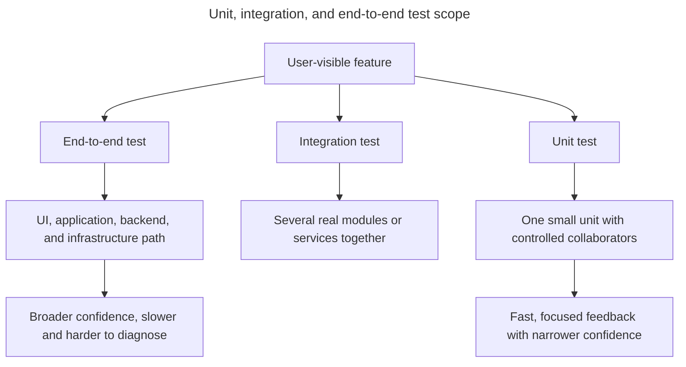

## TL;DR

- **Unit test**: Exercises a small behavior with controlled dependencies. Fast and precise, but cannot prove that modules are wired correctly.
- **Integration test**: Exercises collaborating modules or a real boundary such as an HTTP handler plus database adapter. Catches contract and wiring defects at moderate cost.
- **End-to-end (E2E) test**: Drives a deployed or production-like system through its public UI or API. Gives confidence in critical user journeys, but is slower and more expensive to diagnose and maintain.

Use a mix based on risk. A checkout calculation deserves many unit cases, the order endpoint deserves integration coverage, and a few Playwright flows should prove that a user can complete checkout in a real browser.

---

## Test scope and boundaries

The layers differ primarily in how much real system behavior they include and which boundaries they replace.



A healthy suite combines the layers rather than treating one as a universal replacement for the others.

## Compare the layers through one feature

| Layer | Checkout example | Common tools | Main tradeoff |
| --- | --- | --- | --- |
| Unit | Calculate tax, discounts, and validation for controlled inputs | Vitest, Jest, Mocha, Node.js test runner | Fast feedback, limited boundary confidence |
| Integration | Submit an order through the HTTP handler and verify stored records | Test runner plus Supertest, a test database, or MSW | More realistic setup and cleanup |
| E2E | Add an item, enter delivery details, pay, and see confirmation | Playwright, Cypress, Selenium | Highest system confidence, slower diagnosis |

The labels describe scope, not a specific tool. A Vitest test can be an integration test; a Playwright test can exercise one page or a whole multi-service journey.

## Unit test

```js
test('applies free shipping at the exact threshold', () => {
  expect(calculateShipping({ subtotal: 50, isMember: false })).toBe(0);
});
```

This is ideal for many edge cases because it has no browser, network, or database. It cannot detect that the API passes a subtotal as the wrong field or that the UI displays the wrong result.

## Integration test

```js
test('POST /orders stores the calculated total', async () => {
  const response = await request(app)
    .post('/orders')
    .send({ productId: 'shoe-1', quantity: 2 });

  expect(response.status).toBe(201);
  await expect(
    testDatabase.orders.find(response.body.id),
  ).resolves.toMatchObject({
    quantity: 2,
  });
});
```

This catches routing, serialization, service, and persistence integration errors. Keep the database isolated per test and reset state so parallel runs do not interfere. If the real database behavior matters, an in-memory substitute may hide dialect, transaction, or constraint differences.

## End-to-end test

```js
import { expect, test } from '@playwright/test';

test('customer can complete checkout', async ({ page }) => {
  await page.goto('/products/shoe-1');
  await page.getByRole('button', { name: 'Add to cart' }).click();
  await page.getByRole('link', { name: 'Checkout' }).click();
  await page.getByLabel('Email').fill('buyer@example.com');
  await page.getByRole('button', { name: 'Place order' }).click();

  await expect(
    page.getByRole('heading', { name: 'Order confirmed' }),
  ).toBeVisible();
});
```

Use resilient, user-facing locators and wait for observable outcomes rather than fixed sleeps. Run against controlled accounts and payment sandboxes; never let an automated test charge real customers or mutate production data.

## Choosing the mix

Put most combinations and error cases at the lowest layer that can prove them. Add integration tests where the risk lies between modules, and reserve E2E tests for high-value journeys and browser-specific behavior. Duplicating every case at every layer increases cost without proportional confidence.

## Further reading

- [Vitest guide](https://vitest.dev/guide/)
- [Playwright: Best practices](https://playwright.dev/docs/best-practices)
- [Cypress: Testing types](https://docs.cypress.io/app/core-concepts/testing-types)
