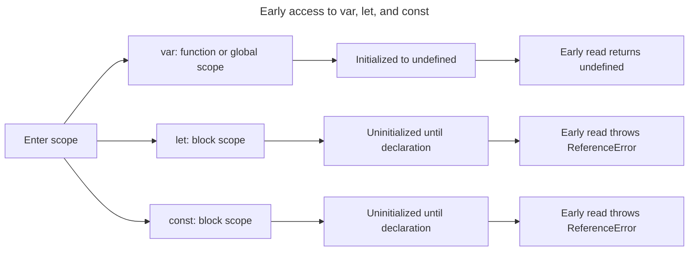

## TL;DR

Before a scope's statements run, JavaScript creates its `var`, `let`, and `const` bindings; it does not move source text. A `var` binding is initialized to `undefined`, so it can be read before its declaration appears. A `let` or `const` binding remains uninitialized in the temporal dead zone (TDZ), so reading it before evaluation reaches the declaration throws `ReferenceError`. `const` also requires an initializer and cannot be reassigned.

---

## Early access across declaration kinds

All three declarations create bindings before their declaration statement runs, but their scope and initialization rules differ.



The temporal dead zone is the interval between entering the block and executing the lexical declaration, not evidence that the binding is absent.

## Hoisting differences between `var`, `let`, and `const`

### `var` hoisting

When a function or script scope is instantiated, its `var` bindings are created and initialized to `undefined`. The initializer still runs where it appears in source, so an earlier read returns `undefined`.

```js live
console.log(a); // Output: undefined
var a = 10;
console.log(a); // Output: 10
```

### `let` hoisting

When a block scope is instantiated, its `let` bindings are created but not initialized. This creates a temporal dead zone (TDZ) from the start of the block until evaluation reaches the declaration. Accessing the variable in the TDZ results in a `ReferenceError`.

```js live
console.log(b); // ReferenceError: Cannot access 'b' before initialization
let b = 20;
console.log(b); // Output: 20
```

### `const` hoisting

`const` bindings are created and left uninitialized during block-scope instantiation, just like `let`, so they also have a TDZ. Additionally, `const` requires an initial value at the declaration and cannot be reassigned.

```js live
console.log(c); // ReferenceError: Cannot access 'c' before initialization
const c = 30;
console.log(c); // Output: 30
```

## Further reading

- [MDN Web Docs: var](https://developer.mozilla.org/en-US/docs/Web/JavaScript/Reference/Statements/var)
- [MDN Web Docs: let](https://developer.mozilla.org/en-US/docs/Web/JavaScript/Reference/Statements/let)
- [MDN Web Docs: const](https://developer.mozilla.org/en-US/docs/Web/JavaScript/Reference/Statements/const)
- [JavaScript.info: Variable scope, closure](https://javascript.info/closure#var)
