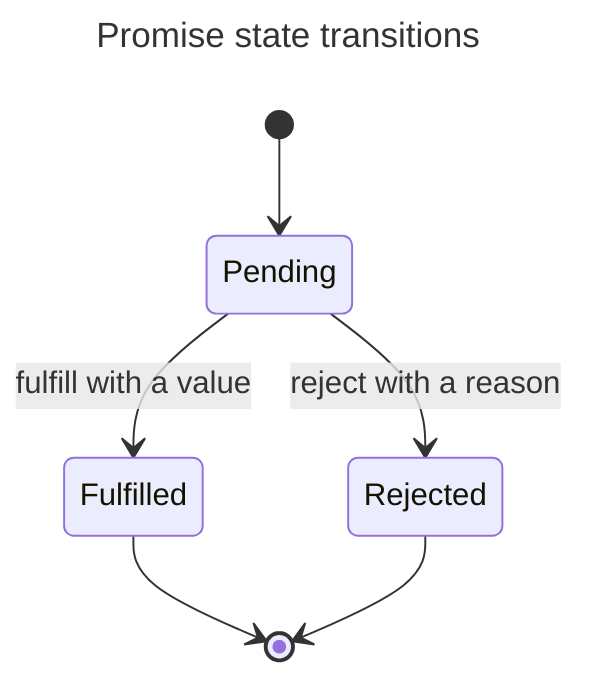

## TL;DR

A Promise has three mutually exclusive states:

- **Pending**: It has not fulfilled or rejected yet.
- **Fulfilled**: It completed with a value.
- **Rejected**: It completed with a reason, conventionally an `Error`.

Fulfilled and rejected Promises are **settled**. Once settled, a Promise cannot change state; later attempts to fulfill or reject it are ignored. “Resolved” is not always synonymous with “fulfilled”: a Promise can be resolved to another still-pending Promise and adopt its eventual state.

---

## Promise state transitions

A promise begins pending and can settle exactly once into one of two terminal states.



“Resolved” is broader than “fulfilled”: resolving with another pending promise locks in adoption of that promise while the outer promise can remain pending.

## Observe the state transition

JavaScript does not expose a synchronous `promise.state` property. You observe the outcome by attaching handlers:

```js live
const promise = new Promise((resolve) => {
  console.log('executor');
  setTimeout(() => resolve('saved'), 0);
});

promise.then((value) => console.log(value));
console.log('after setup');

// executor
// after setup
// saved
```

The executor runs synchronously while the Promise is constructed. The Promise remains pending until the timer task calls `resolve`; its `.then()` reaction then runs as a microtask.

## Pending

A pending Promise may eventually fulfill, reject, or remain pending forever. A common accidental forever-pending Promise forgets to call either callback on one control-flow branch.

```js
const pending = new Promise(() => {});
```

## Fulfilled

Fulfillment carries a value, including `undefined` when no value is supplied:

```js live
Promise.resolve({ id: 42 }).then((user) => console.log(user.id)); // 42
```

## Rejected

Rejection carries a reason. Reject with an `Error` so callers receive a useful message and stack:

```js live
Promise.reject(new Error('Save failed')).catch((error) => {
  console.error(error.message); // Save failed
});
```

Attach a rejection handler or propagate the Promise to a caller that will. An unhandled rejection can be reported by the browser or terminate a Node.js process depending on runtime policy.

## Settling happens once

Only the first settlement attempt has an effect:

```js live
const promise = new Promise((resolve, reject) => {
  resolve('first');
  reject(new Error('too late'));
  resolve('also too late');
});

promise.then(console.log); // first
```

This guarantee makes callbacks easier to compose, but application code should still clean up timers, listeners, or requests that are no longer needed; settling a Promise does not automatically cancel the underlying operation.

## Further reading

- [ECMAScript specification: Promise objects](https://tc39.es/ecma262/multipage/control-abstraction-objects.html#sec-promise-objects)
- [MDN: Promise](https://developer.mozilla.org/en-US/docs/Web/JavaScript/Reference/Global_Objects/Promise)
- [Promises/A+ specification](https://promisesaplus.com/)
