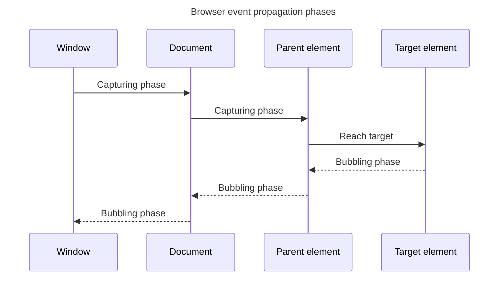

## TL;DR

In a browser, events go through three phases: capturing, target, and bubbling. During the capturing phase, the event travels from the root to the target element. In the target phase, the event reaches the target element. Finally, in the bubbling phase, the event travels back up from the target element to the root. You can control event handling using `addEventListener` with the `capture` option.

---

## Propagation path

An event travels down the ancestor path during capture, reaches the target, and—when the event bubbles—travels back up that path.



Capture listeners run on the downward path and ordinary listeners run on the upward path; listeners registered on the target run at the target phase.

## Event phases in a browser

### Capturing phase

The capturing phase, also known as the trickling phase, is the first phase of event propagation. During this phase, the event starts from the root of the DOM tree and travels down to the target element. Event listeners registered for this phase will be triggered in the order from the outermost ancestor to the target element.

```js
element.addEventListener('click', handler, true); // true indicates capturing phase
```

### Target phase

The target phase is the second phase of event propagation. In this phase, the event has reached the target element itself. Event listeners registered directly on the target element will be triggered during this phase.

```js
element.addEventListener('click', handler); // listener on the target fires during the target phase
```

### Bubbling phase

The bubbling phase is the final phase of event propagation. During this phase, the event travels back up from the target element to the root of the DOM tree. Event listeners registered for this phase will be triggered in the order from the target element to the outermost ancestor.

```js
element.addEventListener('click', handler, false); // false indicates bubbling phase
```

### Controlling event propagation

You can control event propagation using methods like `stopPropagation` and `stopImmediatePropagation`. These methods can be called within an event handler to stop the event from propagating further.

```js
element.addEventListener('click', function (event) {
  event.stopPropagation(); // Stops the event from propagating further
});
```

## Further reading

- [MDN Web Docs: Event bubbling and capturing](https://developer.mozilla.org/en-US/docs/Learn/JavaScript/Building_blocks/Events#event_bubbling_and_capture)
- [JavaScript.info: Bubbling and capturing](https://javascript.info/bubbling-and-capturing)
- [W3C: DOM Level 3 Events Specification](https://www.w3.org/TR/DOM-Level-3-Events/#event-flow)
