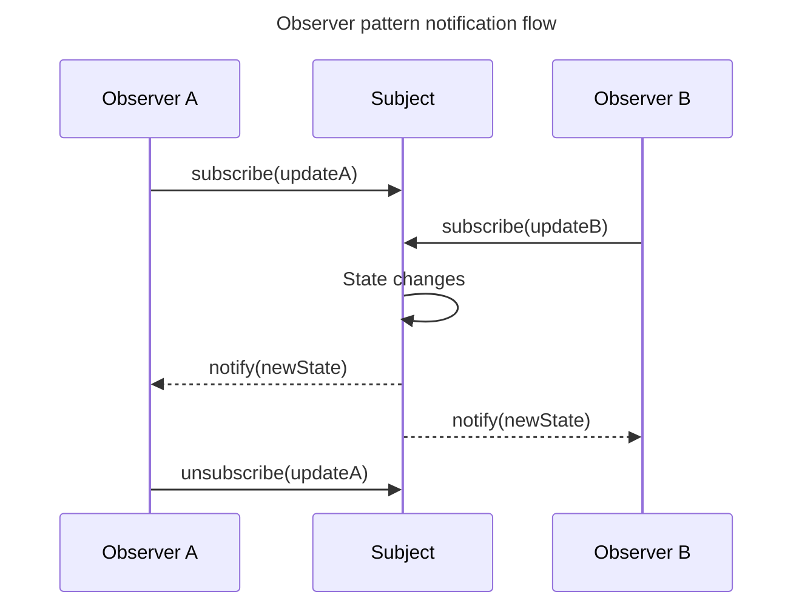

## TL;DR

The Observer pattern lets a subject publish changes to subscribed observers without knowing their concrete implementations. It fits UI events, state stores, and in-process notifications where multiple consumers react to one source. A practical subscription API should return an unsubscribe function and define whether delivery is synchronous, how listener errors are handled, and what happens when listeners subscribe or unsubscribe during notification.

Use it when one-to-many notifications reduce coupling. Prefer a direct function call when there is only one known consumer or when the operation needs an immediate result; hidden event chains can make ordering and failures difficult to trace.

---

## Subscription and notification

Observers register with a subject, which later broadcasts a state change without needing to know each observer's concrete behavior.



Unsubscription and failure isolation matter in long-lived systems so stale observers do not leak and one observer cannot prevent all later notifications.

## A practical implementation

```js live
function createSubject() {
  const listeners = new Set();

  return {
    subscribe(listener) {
      listeners.add(listener);
      return () => listeners.delete(listener);
    },

    publish(value) {
      // Snapshot so subscription changes do not alter this delivery pass.
      for (const listener of [...listeners]) {
        listener(value);
      }
    },
  };
}

const connection = createSubject();
const unsubscribe = connection.subscribe((status) => {
  console.log(`Connection: ${status}`);
});

connection.publish('online'); // Connection: online
unsubscribe();
connection.publish('offline'); // No output
```

Using a `Set` avoids accidental duplicate subscriptions. Returning cleanup from `subscribe()` makes ownership explicit and prevents a long-lived subject from retaining disposed UI and its closed-over data.

## Delivery choices

This example notifies synchronously. Therefore a slow observer delays the publisher, and a thrown exception stops later observers. Depending on the application, the subject can isolate listener errors, queue notifications, or use an asynchronous event system—but those choices change ordering and error propagation and should be documented.

For streams with backpressure, cancellation, completion, and error channels, an async iterator or a stream abstraction may fit better than a minimal Observer.

## Common use cases

- DOM event targets notify registered event listeners.
- A state store notifies views that selected state changed.
- A connection manager notifies status indicators, retry controls, and telemetry.
- A domain-event publisher notifies independent in-process handlers.

For cross-process messaging, a broker adds durability, delivery, ordering, and retry concerns beyond the in-memory Observer pattern.

## Further reading

- [Observer pattern](https://en.wikipedia.org/wiki/Observer_pattern)
- [MDN: `EventTarget`](https://developer.mozilla.org/en-US/docs/Web/API/EventTarget)
- [MDN: Async iterator and async iterable protocols](https://developer.mozilla.org/en-US/docs/Web/JavaScript/Reference/Iteration_protocols#the_async_iterator_and_async_iterable_protocols)
