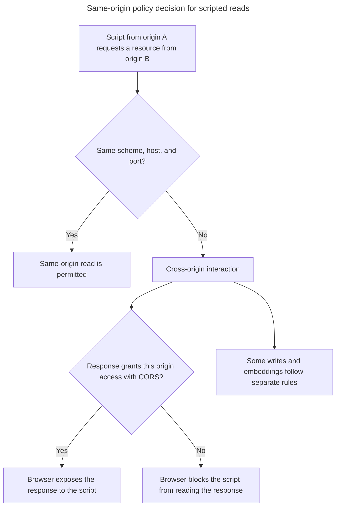

## TL;DR

The same-origin policy limits how code from one origin can interact with resources from another origin. An origin is the tuple of scheme, host, and port. Browsers permit many cross-origin writes and embeds, such as form submissions, links, images, and scripts, but normally prevent a page from reading a cross-origin response or another origin's DOM. CORS lets a server opt specific origins into reading a response; it is not what makes the request itself possible.

---

## Comparing origins before a scripted read

For ordinary web URLs, an origin is the tuple of scheme, host, and port; path differences do not create different origins.



CORS relaxes selected cross-origin reads; it is not an authentication mechanism and does not disable the same-origin policy globally.

## What is the same-origin policy?

The same-origin policy is a critical browser security boundary. It prevents a malicious site from reading sensitive data from another site using the victim's ambient credentials. It is not an XSS or CSRF defense by itself: XSS runs as the vulnerable site's origin, and cross-origin writes such as form submissions are one reason separate CSRF defenses are needed.

### Definition of origin

An origin is defined by the scheme (protocol), host (domain), and port of a URL. For example, the origin of `http://example.com:80/page` is:

- Scheme: `http`
- Host: `example.com`
- Port: `80`

Two URLs have the same origin if and only if all three components (scheme, host, and port) are identical.

### How it works

Cross-origin network requests are often sent, but JavaScript normally receives only an opaque or blocked result unless the request mode and the server's CORS response headers permit access. Some requests trigger a CORS preflight. Separately, the policy restricts script access to cross-origin windows and frames, exposing only a small set of operations such as `postMessage()`.

### Example

Consider the following example:

- `http://example.com/page1` can access `http://example.com/page2` because they share the same origin.
- `http://example.com/page1` cannot access `http://anotherdomain.com/page` because they have different origins.

### Cross-origin mechanisms

Common mechanisms intentionally cross the origin boundary in controlled ways:

- **CORS**: Response headers through which a server grants selected origins access to a response.
- **`postMessage()`**: Explicit cross-origin messaging between window objects, provided senders specify a target origin and receivers validate the sender.
- **JSONP**: A legacy technique that loads cross-origin code through a `<script>` element. It is GET-only and executes the response as code, so CORS is preferred.
- **WebSockets**: Use an opening handshake with an `Origin` header that the server must validate; they are not a general exemption from browser security checks.

### Code example

Here is a simple example demonstrating the same-origin policy:

```html
<!-- index.html -->
<script>
  // This will work because the request is to the same origin
  fetch('/api/data')
    .then((response) => response.json())
    .then((data) => console.log(data));

  // The response is readable only if the other server allows this origin with CORS.
  fetch('http://anotherdomain.com/api/data')
    .then((response) => response.json())
    .then((data) => console.log(data))
    .catch((error) => console.error('Error:', error));
</script>
```

## Further reading

- [MDN Web Docs: Same-origin policy](https://developer.mozilla.org/en-US/docs/Web/Security/Same-origin_policy)
- [MDN Web Docs: Cross-Origin Resource Sharing (CORS)](https://developer.mozilla.org/en-US/docs/Web/HTTP/CORS)
- [OWASP: Cross-Site Scripting (XSS)](https://owasp.org/www-community/attacks/xss/)
- [OWASP: Cross-Site Request Forgery (CSRF)](https://owasp.org/www-community/attacks/csrf)
