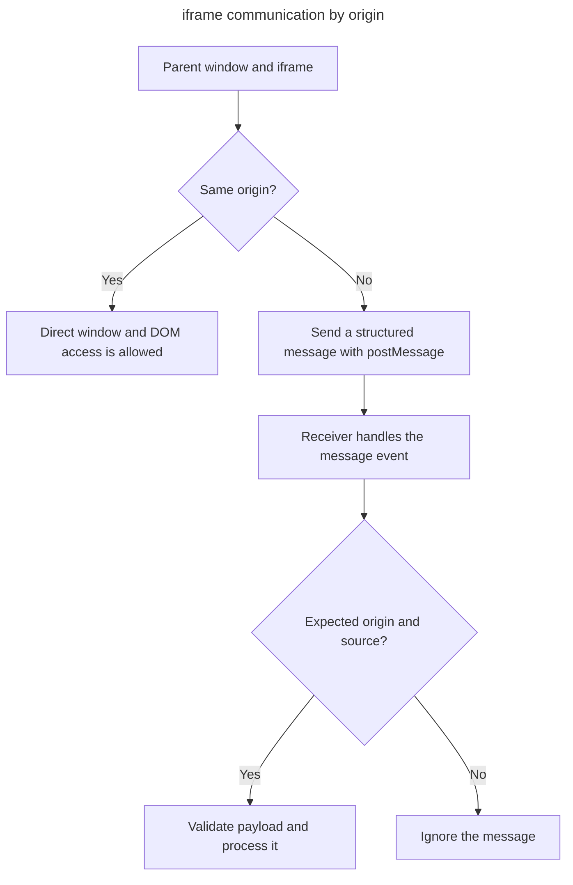

## TL;DR

Parent pages and iframes can communicate across origins with `postMessage()`. It is secure only when the sender uses the exact target origin and the receiver validates `event.origin`, usually `event.source`, and the shape of `event.data`.

```js
// In the parent page
const iframe = document.querySelector('iframe');
iframe.contentWindow.postMessage('Hello from parent', 'https://widget.example');

// In the iframe
window.addEventListener('message', (event) => {
  if (event.origin !== 'https://parent.example') return;
  if (event.source !== window.parent) return;
  console.log(event.data); // 'Hello from parent'
});
```

---

## Choose communication by origin

Direct DOM access is available only when both documents satisfy the same-origin policy; `postMessage()` is the explicit cross-origin channel.



Always use a specific `targetOrigin` when sending sensitive data and verify both `event.origin` and, when possible, `event.source` when receiving.

## How do `<iframe>` on a page communicate?

### Using the `postMessage` API

The `postMessage` API is the most common and secure way for iframes to communicate with each other or with their parent page. This method allows for cross-origin communication, which is essential for modern web applications.

#### Sending a message

To send a message from the parent page to the iframe, you can use the `postMessage` method. Here’s an example:

```js
// In the parent page
const iframe = document.querySelector('iframe');
iframe.contentWindow.postMessage('Hello from parent', 'https://widget.example');
```

The second argument is the origin the receiving window must have for the message to be delivered. Avoid `'*'` when the destination has a known origin, because the frame can navigate to an unexpected origin between obtaining the window reference and sending the message.

#### Receiving a message

To receive a message in the iframe, you need to add an event listener for the `message` event:

```js
// In the iframe
window.addEventListener('message', (event) => {
  if (event.origin !== 'https://parent.example') return;
  if (event.source !== window.parent) return;
  console.log(event.data); // 'Hello from parent'
});
```

The `event` object contains the `data` property, which holds the message sent by the parent page.

### Security considerations

When using `postMessage`, it's crucial to consider security:

- **Specify the target origin**: Instead of using `'*'`, specify the exact origin expected for the receiving window.
- **Validate the sender**: Check `event.origin` and, where possible, `event.source`. `targetOrigin` protects the receiver; it does not authenticate messages arriving at your listener.
- **Validate the message**: Treat `event.data` as untrusted input and validate its type and fields before using it.

### Example with target origin

Here’s an example with a specified target origin:

```js
// In the parent page
const iframe = document.querySelector('iframe');
const targetOrigin = 'https://example.com';
iframe.contentWindow.postMessage('Hello from parent', targetOrigin);

// In the iframe
window.addEventListener('message', (event) => {
  if (event.origin !== 'https://parent.com') return;
  if (event.source !== window.parent) return;
  if (typeof event.data !== 'string') return;
  console.log(event.data); // 'Hello from parent'
});
```

In this example, the parent page sends a message only to `https://example.com`, and the iframe processes the message only if it comes from `https://parent.com`.

## Further reading

- [MDN Web Docs: Window.postMessage()](https://developer.mozilla.org/en-US/docs/Web/API/Window/postMessage)
- [HTML Living Standard: postMessage](https://html.spec.whatwg.org/multipage/web-messaging.html#dom-window-postmessage)
- [Cross-document messaging](https://developer.mozilla.org/en-US/docs/Web/API/Window/postMessage#cross-document_messaging)
