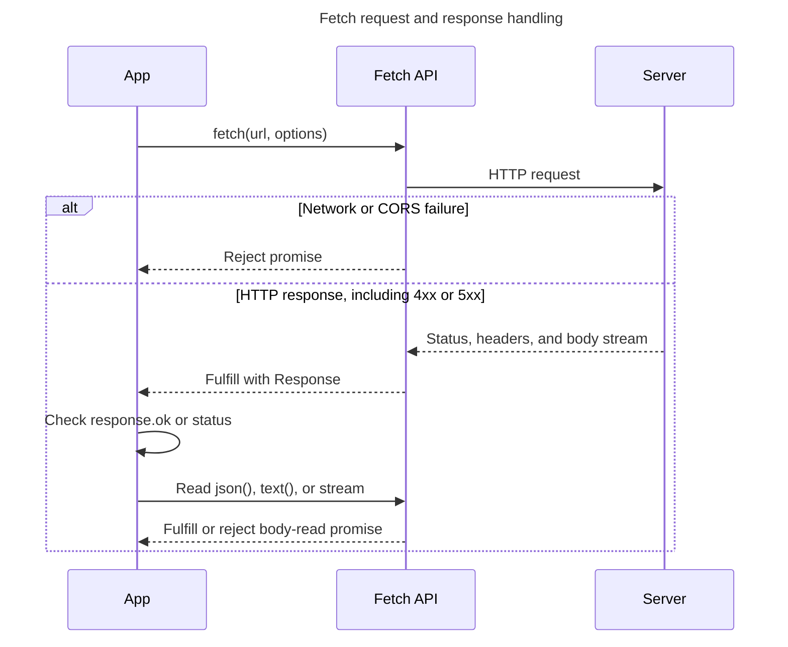

## TL;DR

To make an HTTP request, call `fetch()`, which returns a promise for a `Response`. Fetch rejects for failures such as malformed URLs, network errors, CORS failures, and aborts—not for HTTP statuses such as 404 or 500—so check `response.ok` (or `response.status`) before reading the body.

```js live
fetch('https://jsonplaceholder.typicode.com/todos/1')
  .then((response) => {
    if (!response.ok) throw new Error(`HTTP ${response.status}`);
    return response.json();
  })
  .then((data) => console.log(data))
  .catch((error) => console.error('Error:', error));
```

For a POST request, you can pass an options object as the second argument to `fetch`:

```js live
fetch('https://jsonplaceholder.typicode.com/posts', {
  method: 'POST',
  body: JSON.stringify({
    title: 'foo',
    body: 'bar',
    userId: 1,
  }),
  headers: {
    'Content-Type': 'application/json; charset=UTF-8',
  },
})
  .then((response) => {
    if (!response.ok) throw new Error(`HTTP ${response.status}`);
    return response.json();
  })
  .then((data) => console.log(data))
  .catch((error) => console.error('Error:', error));
```

---

## Fetch completion model

`fetch()` has two asynchronous stages: obtaining a response and, usually, consuming its body.



`fetch()` does not reject merely because the server returns an HTTP error status, so status handling must be explicit.

## Making an HTTP request using the Fetch API

### Basic GET request

To make a basic GET request, you can use the `fetch` function with the URL of the resource you want to fetch. The `fetch` function returns a promise that resolves to the `Response` object representing the response to the request.

```js live
fetch('https://jsonplaceholder.typicode.com/todos/1')
  .then((response) => {
    if (!response.ok) {
      throw new Error('Network response was not ok');
    }
    return response.json();
  })
  .then((data) => console.log(data))
  .catch((error) => console.error('Error:', error));
```

### Handling different response types

The `Response` object has several methods to handle different types of responses, such as `.json()`, `.text()`, `.blob()`, and `.arrayBuffer()`.

```js live
fetch('https://jsonplaceholder.typicode.com/todos/1')
  .then((response) => response.text())
  .then((text) => console.log(text))
  .catch((error) => console.error('Error:', error));
```

### Making a POST request

To make a POST request, you need to pass an options object as the second argument to `fetch`. This object can include the HTTP method, headers, and body of the request.

```js live
fetch('https://jsonplaceholder.typicode.com/posts', {
  method: 'POST',
  body: JSON.stringify({
    title: 'foo',
    body: 'bar',
    userId: 1,
  }),
  headers: {
    'Content-Type': 'application/json; charset=UTF-8',
  },
})
  .then((response) => {
    if (!response.ok) {
      throw new Error('Network response was not ok');
    }
    return response.json();
  })
  .then((data) => console.log(data))
  .catch((error) => console.error('Error:', error));
```

### Handling errors

Use `.catch()` or `try...catch` for rejected promises. Because an HTTP error response still fulfills the Fetch promise, explicitly check `response.ok` (or handle the status codes your application expects).

```js live
fetch('https://jsonplaceholder.tyicode.com/posts/1/comments') // Typo in the URL
  .then((response) => {
    if (!response.ok) {
      throw new Error('Network response was not ok');
    }
    return response.json();
  })
  .then((data) => console.log(data))
  .catch((error) => console.error('Error:', error));
```

### Using async/await

You can also use the Fetch API with `async/await` for more synchronous-looking code.

```js live
async function fetchData() {
  try {
    const response = await fetch(
      'https://jsonplaceholder.typicode.com/todos/1',
    );
    if (!response.ok) {
      throw new Error('Network response was not ok');
    }
    const data = await response.json();
    console.log(data);
  } catch (error) {
    console.error('Error:', error);
  }
}

fetchData();
```

## Further reading

- [MDN Web Docs: Fetch API](https://developer.mozilla.org/en-US/docs/Web/API/Fetch_API)
- [MDN Web Docs: Using Fetch](https://developer.mozilla.org/en-US/docs/Web/API/Fetch_API/Using_Fetch)
- [JavaScript.info: Fetch](https://javascript.info/fetch)
