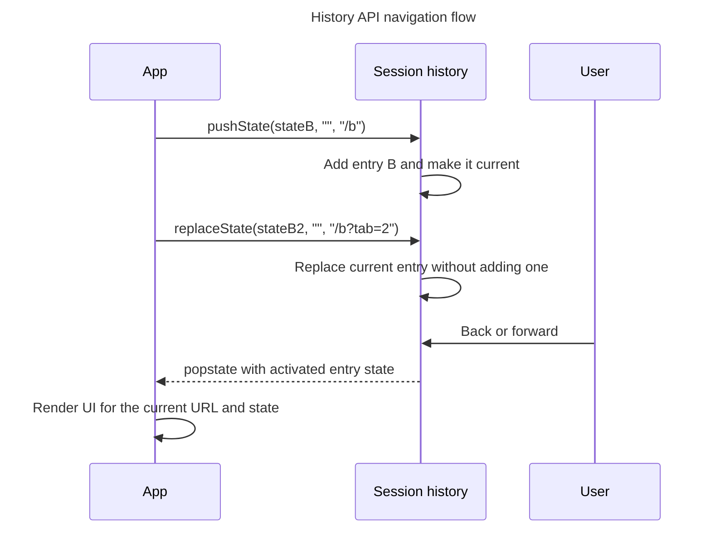

## TL;DR

The History API lets an application add or replace same-origin session-history entries without reloading the document. `pushState()` adds an entry, `replaceState()` updates the current entry, and `back()`, `forward()`, and `go()` traverse history. Changing history does not fetch or render content for you: update the UI and listen for `popstate` so the browser Back and Forward buttons restore the correct view.

---

## Updating and traversing session history

`pushState()` and `replaceState()` change history without loading a new document, while user traversal notifies the application through `popstate`.



Calling `pushState()` or `replaceState()` does not itself fire `popstate`; traversal does.

## Using the `window.history` API

The `window.history` API provides methods to interact with the browser's history stack. This can be useful for single-page applications (SPAs) where you want to manage the URL and browser history without causing a full page reload.

### Methods

#### `history.pushState()`

This method adds a new entry to the history stack.

```js
history.pushState({ page: 1 }, 'title 1', '?page=1');
```

- The first parameter is a state object associated with the new history entry.
- The second parameter is the title of the new history entry (ignored by most browsers).
- The third parameter is the URL to be displayed in the address bar.

#### `history.replaceState()`

This method modifies the current history entry.

```js
history.replaceState({ page: 2 }, 'title 2', '?page=2');
```

- The parameters are the same as `pushState()`, but this method replaces the current entry instead of adding a new one.

#### `history.back()`

This method moves the user back one entry in the history stack, similar to clicking the browser's back button.

```js
history.back();
```

#### `history.forward()`

This method moves the user forward one entry in the history stack, similar to clicking the browser's forward button.

```js
history.forward();
```

#### `history.go()`

This method moves the user a specified number of entries in the history stack.

```js
// Move back one entry
history.go(-1);

// Move forward one entry
history.go(1);

// Reload the current page
history.go(0);
```

### Example

Here is the core routing shape for a small single-page application:

```html
<!doctype html>
<html lang="en">
  <head>
    <meta charset="UTF-8" />
    <title>History API Example</title>
  </head>
  <body>
    <nav>
      <a href="/products" data-route>Products</a>
      <a href="/cart" data-route>Cart</a>
    </nav>
    <main id="app"></main>

    <script>
      const app = document.querySelector('#app');

      function render(url) {
        app.textContent = `Current route: ${url.pathname}`;
      }

      document.addEventListener('click', (event) => {
        const link = event.target.closest('a[data-route]');
        if (!link || event.defaultPrevented || event.button !== 0) return;
        if (event.metaKey || event.ctrlKey || event.shiftKey || event.altKey) {
          return;
        }

        const url = new URL(link.href);
        if (url.origin !== location.origin) return;

        event.preventDefault();
        history.pushState({ route: url.pathname }, '', url);
        render(url);
      });

      window.addEventListener('popstate', () => render(new URL(location.href)));
      render(new URL(location.href));
    </script>
  </body>
</html>
```

`pushState()` does not fire `popstate`; the code that pushes an entry renders immediately. `popstate` handles traversal to an existing entry.

### Constraints and failure modes

- The new URL must be same-origin or `pushState()` / `replaceState()` throws a `SecurityError`.
- The state object must be serializable and should stay small. Store durable application data elsewhere and put only restoration hints in history state.
- Direct navigation or refresh still reaches the server. An SPA server must serve an appropriate document for valid application routes and return real error responses for invalid ones.
- Do not intercept modified clicks, downloads, external links, or links targeting another browsing context; users should keep normal browser behavior.
- History traversal is asynchronous. Code should respond to `popstate` instead of assuming `back()` changes the document immediately.

## Further reading

- [MDN Web Docs: History API](https://developer.mozilla.org/en-US/docs/Web/API/History_API)
- [MDN Web Docs: `history.pushState()`](https://developer.mozilla.org/en-US/docs/Web/API/History/pushState)
- [MDN Web Docs: `history.replaceState()`](https://developer.mozilla.org/en-US/docs/Web/API/History/replaceState)
- [MDN Web Docs: `history.back()`](https://developer.mozilla.org/en-US/docs/Web/API/History/back)
- [MDN Web Docs: `history.forward()`](https://developer.mozilla.org/en-US/docs/Web/API/History/forward)
- [MDN Web Docs: `history.go()`](https://developer.mozilla.org/en-US/docs/Web/API/History/go)
