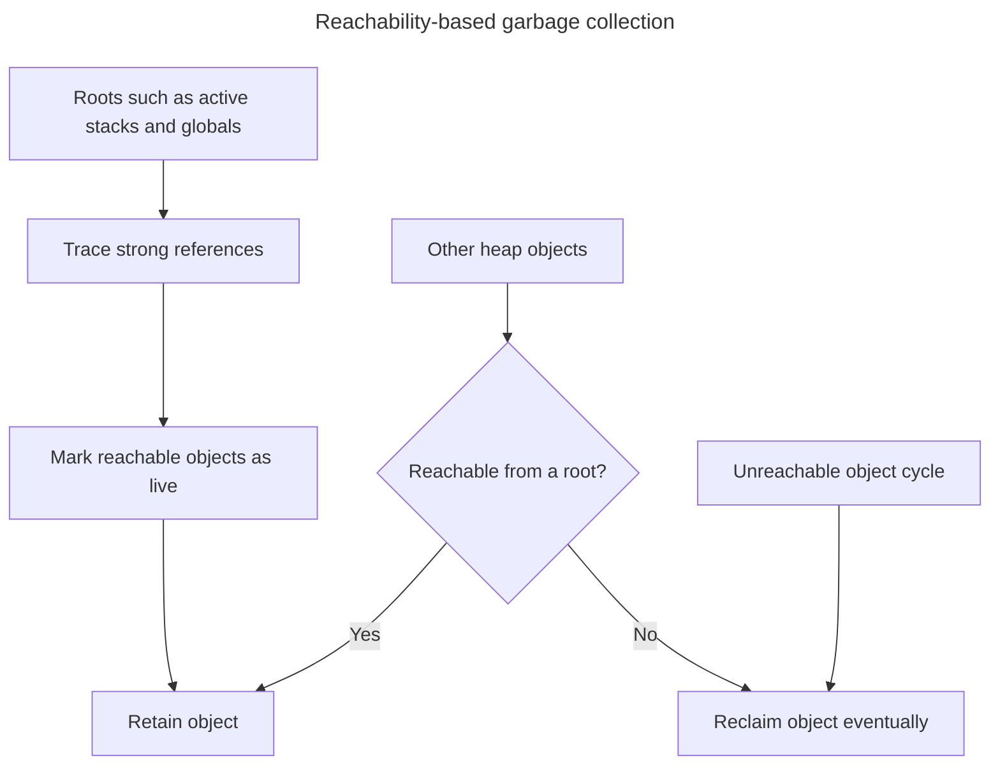

## TL;DR

JavaScript engines automatically reclaim objects that are no longer reachable from roots such as the current call stack, global objects, and live host objects. Modern engines combine tracing collectors with optimizations such as generations, incremental work, and compaction; the exact strategy is an engine implementation detail.

**Mark-and-sweep**

The most common garbage collection algorithm used in JavaScript is the Mark-and-sweep algorithm. It operates in two phases:

- **Marking phase**: The garbage collector traverses the object graph, starting from the root objects (global variables, currently executing functions, etc.), and marks all reachable objects as "in-use".
- **Sweeping phase**: The garbage collector sweeps through memory, removing all unmarked objects, as they are considered unreachable and no longer needed.

This algorithm effectively identifies and removes objects that have become unreachable, freeing up memory for new allocations.

**Generational garbage collection**

Used by modern JavaScript engines, objects are divided into different generations based on their age. Objects start in the young generation, and those that survive several collections are promoted to the old generation. This optimization reduces the overhead of garbage collection by focusing on the younger generation, where most objects are short-lived.

Garbage collection does not prevent memory leaks: a listener, timer, closure, DOM reference, or unbounded cache can keep data reachable even when the application no longer needs it. Diagnose a suspected leak by repeating the problematic action, comparing heap snapshots, and following retaining paths. Do not try to force garbage collection in normal application code.

---

## Reachability from roots

Modern JavaScript garbage collectors determine liveness from roots rather than by counting references, so unreachable cycles can be reclaimed.



Collection timing is intentionally nondeterministic, so resource cleanup should use explicit APIs rather than waiting for garbage collection.

## Garbage collection in JavaScript

Garbage collection in JavaScript is an automatic process managed by the JavaScript engine, designed to reclaim memory occupied by objects that are no longer needed. This helps prevent memory leaks and optimizes the use of available memory. Here's an overview of how garbage collection works in JavaScript:

### Memory management basics

JavaScript allocates memory for objects, arrays, and other variables as they are created. Over time, some of these objects become unreachable because there are no references to them. Garbage collection is the process of identifying these unreachable objects and reclaiming their memory.

### Reachability

The primary concept in JavaScript garbage collection is reachability. An object is considered reachable if it can be accessed or reached in some way:

- **Global variables**: Objects referenced by global variables are always reachable.
- **Local variables and function parameters**: These objects are reachable as long as the function is executing.
- **Closure variables**: Objects referenced by closures are reachable if the closure is reachable.
- **DOM and other system roots**: Objects referenced by the DOM or other host objects.

If there is a chain of references from a root to an object, that object is considered reachable.

### Garbage collection algorithms

1. **Mark-and-sweep**:
   - **Mark phase**: The garbage collector starts from the root objects and marks all reachable objects.
   - **Sweep phase**: It then scans memory for objects that were not marked and reclaims their memory.
2. **Reference counting (historical/simple implementations)**:
   - This algorithm keeps a count of references to each object. When an object's reference count drops to zero, it is considered unreachable and can be collected.
   - A drawback of reference counting is that it cannot handle circular references well (e.g., two objects referencing each other but not referenced by any other object).
3. **Generational garbage collection**:
   - Memory is divided into generations: young and old.
   - Objects are initially allocated in the young generation.
   - Objects that survive multiple collections are promoted to the old generation.
   - Young generation collections are more frequent and faster, while old generation collections are less frequent but cover more objects.

### JavaScript engine implementations

Different JavaScript engines use combinations and variations of these algorithms. Their internals change over time, so application code should rely on reachability rather than a particular collector:

- **V8 (Google Chrome, Node.js)**: Uses a combination of generational, mark-and-sweep, and other optimizations for efficient garbage collection.
- **SpiderMonkey (Mozilla Firefox)**: Uses incremental and generational garbage collection.
- **JavaScriptCore (Safari)**: Uses a mark-and-sweep algorithm with generational collection.

### Memory leaks

Memory leaks in JavaScript occur when a program fails to release memory that it no longer needs, causing the program to consume more and more memory over time.

Memory leaks in JavaScript can occur due to various reasons, including:

- **Accidental global variables**: Unintentionally creating global variables that remain in memory even after they are no longer needed.
- **Closures**: A long-lived closure can retain a large value from its outer scope even after the feature no longer needs it.
- **Event listeners**: Failing to remove event listeners or callbacks when they are no longer needed, causing the associated objects to remain in memory.
- **Caching**: Implementing caches without proper eviction logic, leading to unbounded memory growth over time.
- **Detached DOM node references**: Keeping references to detached DOM nodes, preventing them from being garbage collected.
- **Forgotten timers or callbacks**: Failing to clear timers or callbacks when they are no longer needed, causing their associated data to remain in memory.

Circular references are not inherently leaks. A tracing collector can reclaim a cycle when nothing reachable points to it. The problem is a reachable reference that keeps the cycle alive.

### Diagnosing a leak in practice

Suppose memory grows whenever a modal is opened and closed:

1. Open DevTools' Memory panel and take a baseline heap snapshot.
2. Open and close the modal several times, then take another snapshot.
3. Compare snapshots and look for growing modal objects or detached DOM nodes.
4. Inspect the retaining path. It may lead to a global event listener, interval, observer, or cache.
5. Add the matching cleanup, repeat the same interaction, and confirm that retained objects no longer grow.

For example, pair setup and cleanup explicitly:

```js
function mountModal(modal) {
  function handleKeydown(event) {
    if (event.key === 'Escape') modal.close();
  }

  window.addEventListener('keydown', handleKeydown);

  return () => {
    window.removeEventListener('keydown', handleKeydown);
  };
}
```

To reduce accidental retention:

- **Remove event listeners**: Remove long-lived listeners when their feature is disposed. A listener on an element that becomes unreachable with its callback can itself be collected.
- **Clear references in closures**: Avoid holding unnecessary references in closures.
- **Manage DOM references**: Explicitly remove DOM nodes and their references when they are no longer needed.
- **Avoid global variables**: Minimize the use of global variables to reduce the risk of inadvertently keeping references alive.

## Further reading

- [Garbage collection - MDN](https://developer.mozilla.org/en-US/docs/Glossary/Garbage_collection)
- [Memory management](https://developer.mozilla.org/en-US/docs/Web/JavaScript/Memory_management)
- [Record heap snapshots in Chrome DevTools](https://developer.chrome.com/docs/devtools/memory-problems/heap-snapshots)
