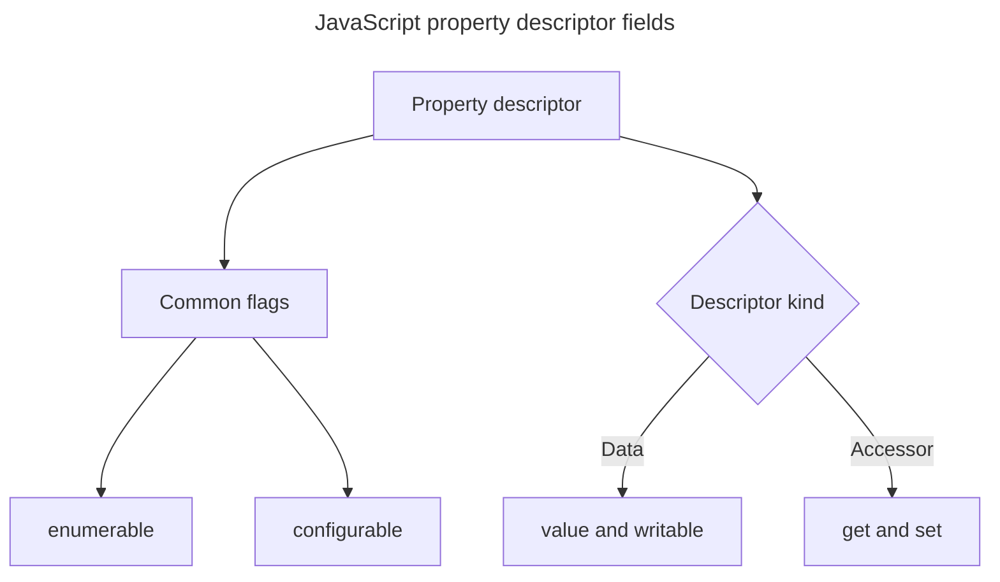

## TL;DR

In JavaScript, property flags and descriptors manage the behavior and attributes of object properties.

**Property flags**

Property flags are used to specify the behavior of a property on an object. Here are the available flags:

- `writable`: Specifies whether the property can be written to.
- `enumerable`: Specifies whether the property is enumerable.
- `configurable`: Controls whether the property can be deleted and whether most parts of its descriptor can be reconfigured.

**Property descriptors**

These provide detailed information about an object's property, including its value and flags. They are retrieved using `Object.getOwnPropertyDescriptor()` and set using `Object.defineProperty()`.

The use cases of property descriptors are as follows:

- Making a property non-writable by setting `writable: false` to ensure data consistency.
- Hiding a property from enumeration by setting `enumerable: false`.
- Preventing property deletion and most descriptor changes by setting `configurable: false`. A writable data property's value can still change, and `writable` can still change from `true` to `false`.
- Applying descriptor restrictions to every existing own property with `Object.seal()` or `Object.freeze()`. Both are shallow, and sealing still permits writes to writable data properties.

---

## Descriptor families

Every own property has a descriptor, but a descriptor is either data-oriented or accessor-oriented; it cannot be both.



`configurable: false` sharply limits later redefinition, while `enumerable` controls visibility in operations such as `Object.keys()` and object spread.

## JavaScript object property flags and descriptors

In JavaScript, property flags and descriptors are used to manage the behavior and attributes of object properties. These flags and descriptors are essential for understanding how properties are accessed, modified, and inherited.

## Property flags

Property flags are used to specify the behavior of a property. They are set using the `Object.defineProperty()` method, which allows you to define a property on an object with specific attributes. The available property flags are:

- `writable`: Specifies whether the property can be written to.
- `enumerable`: Specifies whether the property is enumerable.
- `configurable`: Controls whether the property can be deleted and whether most parts of its descriptor can be reconfigured.

For properties created through normal assignment (e.g. `obj.name = 'John'`), all three flags default to `true`. However, when a property is created via `Object.defineProperty()`, any flag you omit defaults to `false`.

## Property descriptors

Property descriptors provide detailed information about an object's property, encapsulating its value and flags. They are retrieved using `Object.getOwnPropertyDescriptor()` and set using `Object.defineProperty()`.

```js live
let user = { name: 'John Doe' };
let descriptor = Object.getOwnPropertyDescriptor(user, 'name');

console.log(descriptor); // {value: "John Doe", writable: true, enumerable: true, configurable: true}
```

## Manipulating property flags

### `writable` flag

The `writable` flag specifies whether a property can be written to. When `writable` is `false`, trying to assign a value to the property fails silently in non-strict mode, and it throws a `TypeError` in strict mode.

```js live
const obj = {};

Object.defineProperty(obj, 'name', {
  writable: false,
  value: 'John Doe',
});

console.log(obj.name); // Output: John Doe
obj.name = 'Jane Doe'; // This does not change name. Generates TypeError in strict mode
console.log(obj.name); // Output: John Doe (unchanged)
```

### `enumerable` flag

The `enumerable` flag specifies whether a property is enumerable. When the `enumerable` flag is set to `true`, the property is visible in a `for...in` loop.

```js live
const obj = {};

Object.defineProperty(obj, 'name', {
  enumerable: false,
  value: 'John Doe',
});

for (const prop in obj) {
  console.log(prop); // Output: nothing
}

const obj1 = {};

Object.defineProperty(obj1, 'name', {
  enumerable: true,
  value: 'John Doe',
});

for (const prop in obj1) {
  console.log(prop); // Output: name
}
```

### `configurable` flag

The `configurable` flag controls deletion and descriptor reconfiguration. When it is `false`, deletion and forbidden reconfiguration fail silently in non-strict mode or throw `TypeError` in strict mode. For a data property, `configurable: false` does not by itself prevent assignment while `writable` is `true`, and `writable` may still be changed once from `true` to `false`.

```js live
const obj = {};

Object.defineProperty(obj, 'name', {
  configurable: false,
  value: 'John Doe',
});

delete obj.name; // Does not delete property. Generates TypeError in strict mode
console.log(obj.name); // Output: John Doe (not deleted)
```

## `Object.seal()`

The `Object.seal()` method prevents properties from being added or removed and makes every existing own property non-configurable. Existing data-property values can still change while `writable` is `true`, and a writable property may still be made non-writable. Other descriptor reconfiguration, such as changing `enumerable` or converting between data and accessor properties, is not allowed.

## Further reading

- [Object.defineProperty() | MDN](https://developer.mozilla.org/en-US/docs/Web/JavaScript/Reference/Global_Objects/Object/defineProperty)
- [Property flags and descriptors | Javascript.info](https://javascript.info/property-descriptors)
- [Object.seal() | MDN](https://developer.mozilla.org/en-US/docs/Web/JavaScript/Reference/Global_Objects/Object/seal)
