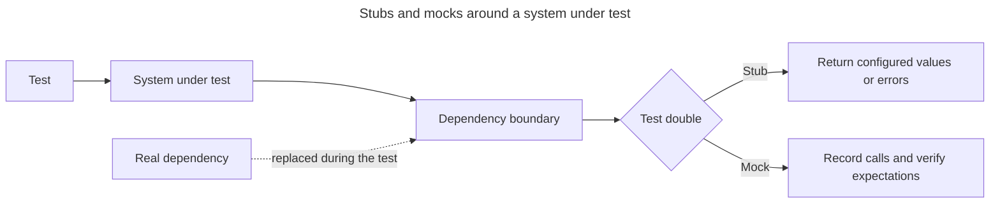

## TL;DR

A **stub** supplies controlled behavior, such as making a payment client return an approved response. A **spy** records calls. A **mock** often combines configured behavior with interaction expectations, although libraries use these terms differently. Use them at slow, nondeterministic, destructive, or unavailable boundaries—not to duplicate every implementation detail. Over-mocking can produce tests that pass while the real modules no longer work together.

---

## Test doubles at a dependency boundary

Both replace a real collaborator, but a stub primarily supplies controlled answers while a mock also asserts how the collaborator was used.



Terminology varies among libraries, so the valuable distinction is whether the double controls indirect input, verifies interaction, or does both.

## Stubs control indirect input

This service depends on a payment client. A stub makes the failure path deterministic without charging a card:

```js
async function placeOrder(paymentClient, order) {
  const payment = await paymentClient.charge(order.total);
  if (!payment.approved) throw new Error('Payment declined');
  return { orderId: order.id, paymentId: payment.id };
}
```

```js
import { expect, test, vi } from 'vitest';

test('rejects a declined payment', async () => {
  const paymentClient = {
    charge: vi.fn().mockResolvedValue({ approved: false }),
  };

  await expect(
    placeOrder(paymentClient, { id: 'order-1', total: 25 }),
  ).rejects.toThrow('Payment declined');
});
```

Here `charge` is acting primarily as a stub: its controlled response drives the code under test.

## Spies and mocks verify indirect output

When the call itself is part of the contract, inspect it:

```js
test('charges the order total once', async () => {
  const charge = vi.fn().mockResolvedValue({ approved: true, id: 'payment-1' });

  await placeOrder({ charge }, { id: 'order-1', total: 25 });

  expect(charge).toHaveBeenCalledOnce();
  expect(charge).toHaveBeenCalledWith(25);
});
```

This test uses the function as both a stub and a spy; it is commonly called a mock function. Sinon, Jest, and Vitest expose related APIs with different terminology.

## When to use them

Good boundaries include payment/email providers, the clock, randomness, filesystem access, and failure responses that are hard to trigger reliably. Prefer a lightweight real implementation when it is fast and deterministic—for example, a real parser or in-memory data structure.

Avoid asserting every internal call sequence. Those tests become coupled to refactoring and can hide integration defects. Add contract or integration tests around important adapters so the fake behavior stays aligned with the real dependency.

Always restore patched globals and spies after the test. Test runners provide hooks such as `afterEach()` and restoration helpers for this cleanup.

## Further reading

- [Vitest: Mocking](https://vitest.dev/guide/mocking)
- [Jest: Mock functions](https://jestjs.io/docs/mock-functions)
- [Sinon documentation](https://sinonjs.org/)
- [Mocks Aren't Stubs](https://martinfowler.com/articles/mocksArentStubs.html)
