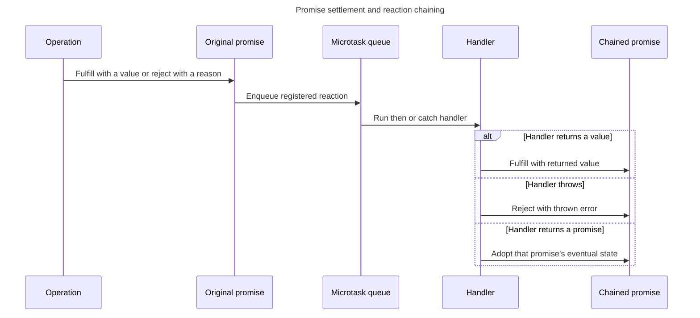

## TL;DR

Promises represent the eventual outcome of an asynchronous operation. They start pending and settle once as fulfilled with a value or rejected with a reason. `.then()`, `.catch()`, and `.finally()` return new Promises, so returned values and thrown errors flow through a chain. Reactions run as microtasks even when the original Promise is already settled.

A Promise coordinates an outcome; it does not automatically start work on another thread or cancel the underlying operation. Expose an `AbortSignal` or another explicit cancellation mechanism when work can be stopped.

```js live
let promise = new Promise((resolve, reject) => {
  // asynchronous operation
  const success = true;
  if (success) {
    resolve('Success!');
  } else {
    reject(new Error('Operation failed'));
  }
});

promise
  .then((result) => {
    console.log(result); // 'Success!' (this will print)
  })
  .catch((error) => {
    console.error(error); // 'Error!'
  });
```

---

## Promise reactions and chaining

A promise separates starting an operation from observing its eventual result; each reaction creates another promise for the handler's outcome.



This is why a `.then()` chain composes transformations and errors instead of mutating the original promise.

## What are Promises and how do they work?

### Definition

Promises are a way to handle asynchronous operations in JavaScript. They provide a cleaner, more readable way to handle asynchronous code compared to traditional callback functions.

### States of a Promise

A promise can be in one of three states:

- `pending`: The initial state, neither fulfilled nor rejected.
- `fulfilled`: The operation completed successfully.
- `rejected`: The operation failed.

### Creating a Promise

You create a promise using the `Promise` constructor, which takes a function with two arguments: `resolve` and `reject`. These are callbacks that you call to change the state of the promise.

```js live
let promise = new Promise((resolve, reject) => {
  // asynchronous operation
  const success = true;
  if (success) {
    resolve('Success!');
  } else {
    reject(new Error('Operation failed'));
  }
});
```

### Handling a Promise

To handle the result of a promise, you use the `.then()` method for a successful outcome and the `.catch()` method for an error.

```js live
let promise = new Promise((resolve, reject) => {
  // asynchronous operation
  const success = false;
  if (success) {
    resolve('Success!');
  } else {
    reject('Error!');
  }
});

promise
  .then((result) => {
    console.log(result); // 'Success!'
  })
  .catch((error) => {
    console.error(error); // 'Error!' (this will print)
  });
```

### Chaining Promises

Promises can be chained to handle multiple asynchronous operations in sequence. Each `.then()` returns a new promise, allowing for further chaining.

```js live
new Promise((resolve, reject) => {
  setTimeout(() => {
    resolve('Promise 1 resolved after 1 second');
  }, 1000);
})
  .then((result) => {
    console.log(result);
    return 'Another promise';
  })
  .then((anotherResult) => {
    console.log(anotherResult);
  })
  .catch((error) => {
    console.error(error);
  });
```

### Combining Promises

You can use `Promise.all()` to run multiple promises in parallel and wait for all of them to complete.

```js live
let promise1 = Promise.resolve('First');
let promise2 = Promise.resolve('Second');
let promise3 = new Promise((resolve, reject) => {
  setTimeout(() => {
    resolve('Third');
  }, 2000);
});

Promise.all([promise1, promise2, promise3]).then((results) => {
  console.log(results); // ['First', 'Second', 'Third']
});
```

In the above example, while `promise1` and `promise2` resolve instantly, `Promise.all` waits for `promise3`, which takes 2 seconds, before logging the results.

### Practical failure modes

- Constructing a Promise runs its executor synchronously; only its eventual reactions are deferred.
- Forgetting to `return` a Promise inside `.then()` breaks sequencing and error propagation.
- A Promise can remain pending forever if the underlying API never settles it.
- Reject with an `Error` to preserve a useful message and stack.
- `Promise.all()` rejects after the first input rejection, but it does not cancel the other operations. Pass a shared cancellation signal when that behavior is required.
- Always return, await, or otherwise handle a Promise. A discarded Promise can produce an unhandled rejection.

## Further reading

- [MDN Web Docs: Promise](https://developer.mozilla.org/en-US/docs/Web/JavaScript/Reference/Global_Objects/Promise)
- [JavaScript.info: Promises](https://javascript.info/promise-basics)
