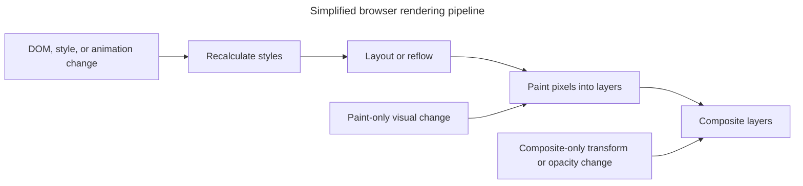

## TL;DR

Measure rendering work first. Keep the DOM and affected layout area small, batch related mutations, group layout reads before writes, and schedule visual changes with `requestAnimationFrame()`. Prefer animating `transform` and `opacity` when appropriate. Use `will-change` only shortly before a known expensive change and remove it afterward; leaving it broadly enabled can waste memory and make performance worse.

---

## Browser rendering work

Different changes enter the rendering pipeline at different stages, so avoiding layout-triggering work can save more than merely reducing paint.



The exact stages depend on the property and browser; measure with performance tools instead of assuming every DOM change causes a full pipeline.

## Techniques for reducing reflows and repaints

### Minimize DOM manipulations

Frequent changes to the DOM can cause multiple reflows and repaints. To minimize this:

- Use `DocumentFragment` to batch DOM updates
- Clone nodes, make changes, and then replace the original node

### Batch DOM changes

Grouping multiple DOM changes together can reduce the number of reflows and repaints:

- Build a detached subtree and replace or append it once. Use `innerHTML` only for trusted or correctly sanitized markup; performance is not a reason to create an XSS sink.
- Use `requestAnimationFrame` to batch updates

### Use CSS classes for style changes

Instead of changing styles directly via JavaScript, use CSS classes:

```js live
const element = document.createElement('h1');
element.classList.add('text-center');

console.log(element); // Notice that the class has been added.
```

### Keep style and layout scope manageable

Selector cost is usually secondary to the amount of DOM and layout affected by a change. Prefer clear selectors, contain independent regions where appropriate, and profile style recalculation before rewriting selectors solely for speed.

### Use `requestAnimationFrame` for animations

Using `requestAnimationFrame` ensures that animations are synchronized with the browser's repaint cycle:

```js
function animate() {
  // Animation logic
  requestAnimationFrame(animate);
}
requestAnimationFrame(animate);
```

### Use `will-change` sparingly

The `will-change` property can ask the browser to prepare for a specific upcoming change. Apply it shortly before the change and remove it afterward; do not add it permanently to many elements.

```css
.element {
  will-change: transform;
}
```

### Avoid layout thrashing

Reading and writing to the DOM separately can prevent layout thrashing:

```js live
// Mock div element
const element = document.createElement('div');

const height = element.offsetHeight; // Read
element.style.height = `${height + 10}px`; // Write

console.log(element);
```

## Further reading

- [MDN Web Docs: Reflow](https://developer.mozilla.org/en-US/docs/Glossary/Reflow)
- [web.dev: Avoid large, complex layouts and layout thrashing](https://web.dev/articles/avoid-large-complex-layouts-and-layout-thrashing)
- [CSS-Tricks: Debouncing and Throttling Explained Through Examples](https://css-tricks.com/debouncing-throttling-explained-examples/)
