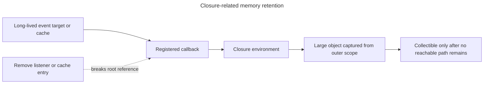

## TL;DR

Closures are not inherently leaks or performance problems. The main risk is accidentally keeping a closure reachable through a long-lived listener, timer, cache, or callback when its captured state includes a large object graph. Closures can also make state flow harder to follow, and loop closures created with `var` can unintentionally share one binding. Release long-lived registrations when they are no longer needed and use block-scoped bindings for per-iteration state.

---

## Accidental retention

A closure can keep much more data alive than expected when a long-lived listener, timer, or cache retains the closure.



The closure itself is not a leak; the leak is an unintended reachable path that outlives the useful work.

## Potential pitfalls of using closures

### Memory leaks

Reachable closures keep the lexical state they need reachable. That is intentional, not a leak by itself. Memory becomes a problem when some long-lived object retains a closure after the application no longer needs it, especially if the closure can reach a large object graph.

```js live
function createClosure() {
  let largeArray = new Array(1000000).fill('some data');
  return function () {
    console.log(largeArray[0]);
  };
}

let closure = createClosure();
// largeArray remains reachable while closure remains reachable.
closure(); // Output: 'some data'

closure = null; // It can now be collected if nothing else retains it.
```

### Debugging complexity

Closures can make debugging more difficult due to the complexity of the scope chain. When a bug occurs, it can be challenging to trace the source of the problem through multiple layers of nested functions and scopes.

```js live
function outerFunction() {
  let outerVar = 'I am outside!';

  function innerFunction() {
    console.log(outerVar); // What if outerVar is not what you expect?
  }

  return innerFunction;
}

let myFunction = outerFunction();
myFunction(); // Output: 'I am outside!'
```

### Performance issues

Creating many retained callbacks has allocation and memory costs, as creating many objects does. Measure before optimizing; the important distinction is whether the callbacks remain reachable. An immediately invoked closure does not permanently retain its environment after it returns.

```js live
function registerHandler(element, records) {
  const handleClick = () => console.log(records.length);
  element.addEventListener('click', handleClick);

  // Cleanup removes the long-lived registration. If nothing else refers to
  // handleClick or records, both can become eligible for garbage collection.
  return () => element.removeEventListener('click', handleClick);
}
```

### Unintended variable sharing

Closures can lead to unintended variable sharing, especially in loops. This happens when all closures share the same reference to a variable, leading to unexpected behavior.

```js live
function createFunctions() {
  let functions = [];

  for (var i = 0; i < 3; i++) {
    functions.push(function () {
      console.log(i); // All functions will log the same value of i
    });
  }

  return functions;
}

let funcs = createFunctions();
funcs[0](); // 3
funcs[1](); // 3
funcs[2](); // 3
```

To avoid this, use `let` instead of `var` to create a new binding for each iteration:

```js live
function createFunctions() {
  let functions = [];

  for (let i = 0; i < 3; i++) {
    functions.push(function () {
      console.log(i); // Each function will log its own value of i
    });
  }

  return functions;
}

let funcs = createFunctions();
funcs[0](); // 0
funcs[1](); // 1
funcs[2](); // 2
```

## Further reading

- [MDN Web Docs: Closures](https://developer.mozilla.org/en-US/docs/Web/JavaScript/Closures)
- [JavaScript.info: Closures](https://javascript.info/closure)
- [Understanding JavaScript Closures with Ease](https://medium.com/dailyjs/i-never-understood-javascript-closures-9663703368e8)
