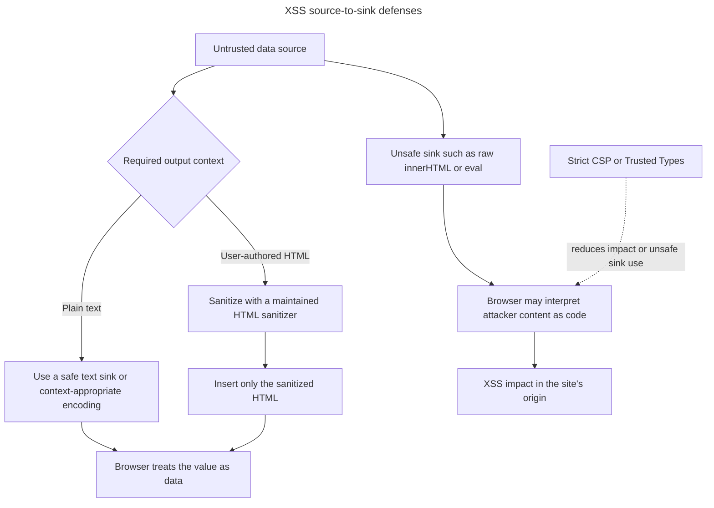

## TL;DR

Cross-Site Scripting (XSS) occurs when untrusted data reaches an executable browser context and runs with a trusted site's origin. Prevent it primarily with context-aware output encoding and safe APIs such as `textContent`, framework text interpolation, and parameterized URL/attribute handling. Sanitize only when the product intentionally accepts HTML, using a maintained HTML sanitizer. Add a nonce- or hash-based Content Security Policy and Trusted Types where applicable as defense in depth; input validation alone is not an XSS defense.

---

## Untrusted data reaching a browser sink

XSS occurs when attacker-controlled data reaches a context that makes the browser interpret it as executable content instead of data.



The correct defense depends on the output context; Content Security Policy is a valuable additional layer, not a substitute for safe sinks, encoding, or sanitization.

## What is Cross-Site Scripting (XSS) and how can you prevent it?

### What is Cross-Site Scripting (XSS)?

Cross-Site Scripting (XSS) is a type of security vulnerability typically found in web applications. It allows attackers to inject malicious scripts into content from otherwise trusted websites. These scripts can then be executed in the context of the user's browser, leading to various malicious activities such as:

- Stealing cookies and session tokens
- Defacing websites
- Redirecting users to malicious sites
- Logging keystrokes

There are three main types of XSS attacks:

1. **Stored XSS**: The malicious script is permanently stored on the target server, such as in a database, comment field, or forum post.
2. **Reflected XSS**: The malicious script is reflected off a web server, such as in an error message, search result, or any other response that includes some or all of the input sent to the server.
3. **DOM-based XSS**: The vulnerability exists in the client-side code rather than the server-side code. The malicious script is executed as a result of modifying the DOM environment in the victim's browser.

### How can you prevent XSS?

#### Validate input and handle each output context safely

Validate input against the application's data rules, but encode or safely insert it at the output sink. For plain text, prefer `textContent` or a framework's escaped text interpolation. HTML, URL, CSS, and JavaScript contexts require different handling; do not reuse one generic escape function for all of them.

If users are intentionally allowed to author HTML, sanitize that markup with a maintained, allowlist-based HTML sanitizer before inserting it:

```js
const sanitizeHtml = require('sanitize-html');

const cleanInput = sanitizeHtml(userInput);
```

#### Use Content Security Policy (CSP)

A Content Security Policy (CSP) is a security feature that helps prevent XSS attacks by specifying which dynamic resources are allowed to load. This can be done by setting HTTP headers.

```http
Content-Security-Policy: default-src 'self'; script-src 'self' https://trusted.cdn.com;
```

#### Encode for the specific output context

Use the framework or platform API designed for the destination context. For ordinary text, avoid constructing HTML at all:

```js
element.textContent = userInput;
```

#### Use HTTP-only cookies

Set session cookies to `HttpOnly` so injected JavaScript cannot read the cookie value directly. This limits one impact of XSS but does not stop malicious code from performing authenticated actions through the victim's browser.

```http
Set-Cookie: sessionId=abc123; HttpOnly; Secure; SameSite=Lax
```

#### Regularly update dependencies

Keep your libraries and frameworks up to date to ensure you have the latest security patches and features.

## Further reading

- [OWASP XSS Prevention Cheat Sheet](https://cheatsheetseries.owasp.org/cheatsheets/Cross_Site_Scripting_Prevention_Cheat_Sheet.html)
- [MDN Web Docs: Content Security Policy (CSP)](https://developer.mozilla.org/en-US/docs/Web/HTTP/CSP)
- [web.dev: Content Security Policy](https://web.dev/articles/csp)
