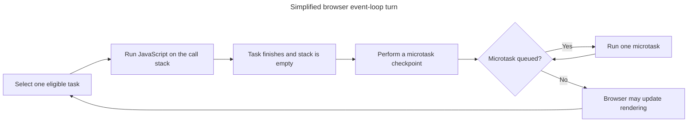

## TL;DR

The event loop is the host runtime's scheduling mechanism for coordinating JavaScript jobs, asynchronous operations, and—in browsers—rendering. A simplified browser turn works like this:

1. The host runs one task, such as initial script evaluation, a timer callback, or an input-event callback. Function calls made by that task use the JavaScript agent's call stack.
2. Timers, networking, and other host APIs continue outside the currently executing JavaScript stack. When work becomes ready, the host queues a task or settles a promise, which queues its reactions as microtasks.
3. After the current task finishes and its stack is empty, the runtime performs a microtask checkpoint. It drains promise reactions, `queueMicrotask()` callbacks, and other microtasks, including microtasks added while the checkpoint is running.
4. The browser may update rendering, then the host selects one eligible task and runs it. After that task, it performs another microtask checkpoint; it does not drain every task queue in one pass.
5. These turns continue for the lifetime of the event loop. An unbounded microtask chain can delay later tasks and rendering.

---

## One browser event-loop turn

The event loop repeatedly runs one task, empties the resulting microtasks, and then gives the browser an opportunity to render before choosing another task.



Timers and I/O do not interrupt the active stack; their completion makes later tasks or promise reactions eligible to run.

## Event loop in JavaScript

The event loop lets a JavaScript agent coordinate asynchronous operations without blocking its currently executing stack. Each agent runs one JavaScript job at a time; workers use separate agents and event loops.

### Parts of the event loop

To understand it better, we need to understand all the parts of the system. These components are part of the event loop:

#### Call stack

The call stack keeps track of the functions being executed in a program. When a function is called, it is added to the top of the call stack. When the function completes, it is removed from the call stack. This allows the program to keep track of where it is in the execution of a function and return to the correct location when the function completes. As the name suggests, it is a stack data structure which follows last-in-first-out.

#### Web APIs/Node.js APIs

Hosts such as browsers and Node.js manage timers, networking, and file I/O outside the currently executing JavaScript stack. The implementation varies: an operation may use operating-system facilities, an evented subsystem, or a worker pool rather than one new thread per operation. When work becomes ready, the host schedules the relevant task or microtask.

#### Task queue / Macrotask queue / Callback queue

Task queues hold tasks that are ready to run. Browsers may maintain multiple task queues and choose among eligible queues according to the HTML event loop rules; "macrotask queue" is convenient informal terminology, not the specification's single queue.

#### Microtasks queue

The microtask queue holds promise reactions, `queueMicrotask()` callbacks, and other microtasks. At a microtask checkpoint, it drains until empty, including newly added microtasks; an unbounded stream can starve later tasks.

### Event loop order

1. The host selects and runs one task. Synchronous function calls made by that task are pushed onto and popped from the call stack.
2. Host facilities handle timers, networking, and I/O outside the active JavaScript stack. When their results become ready, they arrange for tasks or promise reactions to be queued.
3. When the task finishes, the runtime performs a microtask checkpoint and drains the microtask queue, including microtasks queued by other microtasks.
4. In a browser, the host may then update rendering. It selects another eligible task according to host-defined scheduling rules and repeats the cycle.

This model is deliberately simplified: browsers can have multiple task queues, and Node.js divides work into event-loop phases. The key ordering rule is that each completed task is followed by a microtask checkpoint before another task runs.

### Example

The example below mixes synchronous logs with two timer callbacks and two promise callbacks. The first timer's callback enqueues a microtask, and the first promise callback enqueues another timer — small additions that exercise every ordering rule the event loop applies, while keeping each line individually trivial to read.

```js live
console.log('Start');

setTimeout(() => {
  console.log('Timeout 1');
  Promise.resolve().then(() => console.log('Promise 2'));
}, 0);

Promise.resolve().then(() => {
  console.log('Promise 1');
  setTimeout(() => console.log('Timeout 3'), 0);
});

setTimeout(() => console.log('Timeout 2'), 0);

console.log('End');

// Console output:
// Start
// End
// Promise 1
// Timeout 1
// Promise 2
// Timeout 2
// Timeout 3
```

Queue entries in the trace below are labeled by the message their callback will log (so `[Promise 1]` means "the queued callback that will log `Promise 1`"). Names match registration order: `Timeout 1` is the first timer registered, `Promise 2` is the microtask scheduled later by `Timeout 1`'s callback, and so on.

| Step | What just happened | Call stack | Microtask queue | Macrotask queue | Output |
| --- | --- | --- | --- | --- | --- |
| 1 | `console.log('Start')` runs | empty | empty | empty | `Start` |
| 2 | The first `setTimeout` registers a timer with the Web API | empty | empty | empty | `Start` |
| 3 | `Promise.resolve().then(...)` enqueues its callback as a microtask | empty | `[Promise 1]` | empty | `Start` |
| 4 | The second `setTimeout` registers another timer | empty | `[Promise 1]` | empty | `Start` |
| 5 | `console.log('End')` runs; sync script finishes. Both 0 ms timers have elapsed and their callbacks have moved from the Web API into the macrotask queue, in registration order | empty | `[Promise 1]` | `[Timeout 1, Timeout 2]` | `Start, End` |
| 6 | Stack empty → microtask queue drains: `Promise 1` runs and logs, then schedules a new timer whose callback will log `Timeout 3`. The new macrotask is appended to the end of the macrotask queue | empty | empty | `[Timeout 1, Timeout 2, Timeout 3]` | …, `Promise 1` |
| 7 | Microtask queue empty → one macrotask runs: `Timeout 1` logs, then enqueues a new microtask that will log `Promise 2` | empty | `[Promise 2]` | `[Timeout 2, Timeout 3]` | …, `Timeout 1` |
| 8 | Microtask queue is re-checked before the next macrotask (non-empty → drain): `Promise 2` runs and logs | empty | empty | `[Timeout 2, Timeout 3]` | …, `Promise 2` |
| 9 | Microtask queue empty → next macrotask: `Timeout 2` runs and logs | empty | empty | `[Timeout 3]` | …, `Timeout 2` |
| 10 | Microtask queue re-checked (empty) → next macrotask: `Timeout 3` runs and logs | empty | empty | empty | …, `Timeout 3` |

Three rules the trace makes explicit:

- **Microtasks drain before any macrotask.** Step 6 runs `Promise 1` before either timer, even though both timers were scheduled before the promise callback ran.
- **A macrotask that schedules a microtask interleaves.** Step 7 runs `Timeout 1` and enqueues `Promise 2`; step 8 runs `Promise 2` _before_ the next macrotask, not after. The event loop re-checks the microtask queue between every macrotask, which is why a single drain at the end of synchronous code is not enough to model behavior correctly.
- **A microtask that schedules a macrotask appends to the queue.** Step 6 runs `Promise 1` and schedules `Timeout 3`; `Timeout 3` then runs last, after both timers that were already in the macrotask queue. Microtasks cannot promote a macrotask to the front of the line.

## Advanced examples

The examples below demonstrate event loop behaviors that commonly appear in production code and more advanced interview questions.

### `async`/`await` scheduling

`async`/`await` is specified in terms of promise chaining. When execution reaches an `await`, the function is paused, its continuation is scheduled as a microtask on resolution of the awaited value, and control returns to the caller.

```js live
console.log('1');

async function run() {
  console.log('2');
  await Promise.resolve();
  console.log('3');
}

run();

setTimeout(() => console.log('4'), 0);

Promise.resolve().then(() => console.log('5'));

console.log('6');

// Output: 1, 2, 6, 3, 5, 4
```

Explanation:

1. `1` is logged from the first synchronous statement.
2. `run()` is invoked. Synchronous code in the function runs up to the `await`, logging `2`.
3. The continuation of `run()` (everything after the `await`) is scheduled as a microtask. Control returns to the top-level script.
4. `setTimeout` schedules a macrotask.
5. `Promise.resolve().then(...)` schedules a microtask.
6. `6` is logged from the last synchronous statement.
7. The script completes and the microtask queue drains in FIFO order: `run()`'s continuation logs `3`, then the `.then` callback logs `5`.
8. The macrotask queue is then processed, logging `4`.

The common misconception is that `await` blocks execution. It does not — the function is paused, but control returns immediately to the caller, and the continuation runs as a microtask once the awaited value settles.

### Microtask starvation

Macrotasks run only once the microtask queue has fully drained. If microtasks continually schedule more microtasks, the macrotask queue never advances, which prevents rendering, user input handling, and timer callbacks from running.

```js live
let count = 0;

function scheduleMicrotask() {
  Promise.resolve().then(() => {
    count++;
    if (count < 5) scheduleMicrotask();
    console.log('microtask', count);
  });
}

setTimeout(() => console.log('macrotask fired'), 0);

scheduleMicrotask();

// Output: microtask 1, microtask 2, microtask 3, microtask 4, microtask 5, macrotask fired
```

With a bounded recursion depth, the macrotask eventually runs. An unbounded chain (for example `if (true)` instead of `if (count < 5)`) would prevent any macrotask from running and would block rendering in the browser.

To yield to the browser for rendering or input handling, a macrotask is required — for example `setTimeout(fn, 0)`, `MessageChannel`, or `scheduler.yield()` in environments that support it. A microtask such as `queueMicrotask` or `Promise.resolve().then` does not yield.

### Yielding the main thread to split long tasks

A synchronous block that runs longer than 50 ms is classified as a [long task](https://developer.mozilla.org/en-US/docs/Web/API/PerformanceLongTaskTiming) and blocks the browser from rendering, handling input, and processing timers for that duration. The fix is to break the work into chunks and yield to the event loop between chunks so that rendering and other macrotasks can run.

A loop that runs as one task — the entire computation blocks until it finishes:

```js
function heavyWork() {
  let sum = 0;
  for (let i = 0; i < 1e8; i++) sum += i;
  return sum;
}

heavyWork(); // ~hundreds of ms; the page is unresponsive for the duration
```

The same work split across macrotasks via `setTimeout`:

```js live
function chunked(total, chunkSize, onDone) {
  let i = 0;
  let sum = 0;
  function tick() {
    const end = Math.min(i + chunkSize, total);
    while (i < end) {
      sum += i;
      i++;
    }
    if (i < total) {
      setTimeout(tick, 0);
    } else {
      onDone(sum);
    }
  }
  tick();
}

chunked(1e7, 1e6, (sum) => console.log('done', sum));
```

Between every chunk, the browser can paint a frame, dispatch input events, and run other macrotasks. The drawback is that the HTML specification clamps nested `setTimeout` delays to a minimum of 4 ms after 5 levels of recursion, which adds noticeable latency to long chunked computations.

`MessageChannel` schedules a macrotask without that clamp:

```js live
function yieldToMain() {
  return new Promise((resolve) => {
    const channel = new MessageChannel();
    channel.port1.onmessage = () => {
      channel.port1.close();
      channel.port2.close();
      resolve();
    };
    channel.port2.postMessage(null);
  });
}

async function chunked(total, chunkSize) {
  let i = 0;
  let sum = 0;
  while (i < total) {
    const end = Math.min(i + chunkSize, total);
    while (i < end) {
      sum += i;
      i++;
    }
    if (i < total) await yieldToMain();
  }
  return sum;
}

chunked(1e7, 1e6).then((sum) => console.log('done', sum));
```

`postMessage` enqueues a macrotask immediately without delay clamping, so the next chunk runs as soon as the browser has finished its render and any earlier pending tasks. React's scheduler used this pattern before `scheduler.postTask` was widely available. Production code should reuse a single `MessageChannel` instance instead of creating one per yield.

A comparison of the available yielding mechanisms:

| Mechanism | Schedule type | Yields to render? | Notes |
| --- | --- | --- | --- |
| `queueMicrotask` / `Promise.then` | Microtask | No | Drains before render — used for sequencing, not yielding |
| `setTimeout(fn, 0)` | Macrotask | Yes | Clamped to ≥ 4 ms after 5 nested calls per the HTML specification |
| `MessageChannel.postMessage` | Macrotask | Yes | No clamp; ~ 0 ms in practice |
| `scheduler.postTask(fn, { priority })` | Macrotask | Yes | Built-in priority levels (`user-blocking`, `user-visible`, `background`); Chromium-only |
| `scheduler.yield()` | Macrotask | Yes | Returns a promise that resolves on the next yield; preserves task continuation priority; Chromium-only |

Microtasks cannot be used to yield. They drain before rendering, which is the behavior the microtask-starvation example demonstrates.

### `queueMicrotask` compared to `Promise.resolve().then`

Both schedule a microtask in the same FIFO queue and run at the same point in the event loop. They differ in how exceptions thrown inside the callback are surfaced.

```js live
queueMicrotask(() => {
  throw new Error('from queueMicrotask');
});

Promise.resolve().then(() => {
  throw new Error('from promise.then');
});

setTimeout(() => console.log('timeout ran'), 0);
```

- An exception thrown from a `queueMicrotask` callback is reported as an uncaught error and reaches `window.onerror` (in browsers) or `uncaughtException` (in Node).
- An exception thrown from a `.then` callback causes the resulting promise to reject, surfacing through `unhandledrejection` if no downstream `.catch` handles it.

`queueMicrotask` is appropriate when the callback is conceptually standalone and its errors should behave like any other thrown exception. `.then` is appropriate when the callback is part of a promise chain where errors are expected to be caught downstream.

## Differences across runtimes

The event loop is specified differently in browsers, Node.js, and Web Workers. Code that relies on precise scheduling may behave differently across these environments.

### Browsers

Specified in the [HTML Living Standard](https://html.spec.whatwg.org/multipage/webappapis.html#event-loops):

- Each agent has its own event loop.
- The macrotask queue is partitioned into multiple task sources (timers, network I/O, UI events, `postMessage`, and others). FIFO order is guaranteed within a source but not across sources — the user agent may choose any non-empty source each turn.
- `requestAnimationFrame` callbacks run in a separate phase of the event loop, before the render step, rather than on the macrotask queue.
- A browser may update rendering between tasks, but it does not render in the middle of a microtask checkpoint. This is why a long microtask chain can delay rendering.

#### Where `requestAnimationFrame` and `requestIdleCallback` fit

At a rendering opportunity, the simplified order relevant to application code is:

1. Run a selected task, then perform a microtask checkpoint.
2. If the browser decides to update rendering, run eligible `requestAnimationFrame` callbacks.
3. Update style, layout, and paint as needed.
4. Run eligible idle callbacks when the user agent determines there is idle time.

`requestAnimationFrame` schedules work for the next paint, making it the right tool for visual updates synchronized with the display refresh rate (~ 16.7 ms per frame at 60 Hz). `requestIdleCallback` schedules work for the period after rendering and only if the browser has idle time, making it suitable for non-urgent background work.

```js live
console.log('1: sync');
queueMicrotask(() => console.log('2: microtask'));
setTimeout(() => console.log('3: macrotask'), 0);
requestAnimationFrame(() => console.log('4: rAF'));
typeof requestIdleCallback === 'function' &&
  requestIdleCallback(() => console.log('5: rIC'));
console.log('6: sync');

// Guaranteed prefix: 1, 6, 2
// Relative ordering of 3 and 4 depends on timing and the rendering opportunity.
// `5: rIC` may run later or be deferred under load
```

Do not depend on the timer and `requestAnimationFrame` callbacks having a fixed relative order: it varies with when the code runs and whether a rendering opportunity occurs. `requestIdleCallback` can also be deferred; use its timeout option when work must eventually run.

### Node.js

Built on libuv, with additional phases beyond what the HTML spec describes:

- In CommonJS, Node drains the `process.nextTick()` queue before the promise microtask queue after the current operation. In ES modules, top-level scheduling can produce a different order because module evaluation already runs as a microtask.
- Event-loop work is divided into named phases such as timers, pending callbacks, poll (I/O), check (`setImmediate`), and close callbacks. Current Node versions run microtasks after callbacks, not merely once per complete loop iteration.
- At the top level of a script, the execution order of `setImmediate(fn)` and `setTimeout(fn, 0)` is not deterministic and depends on loop timing. Inside an I/O callback, `setImmediate` is guaranteed to run before `setTimeout(fn, 0)`.

`process.nextTick()` is a Node-specific legacy API for most userland scheduling. Prefer `queueMicrotask()` unless the next-tick behavior is specifically required.

A comparison of the Node-specific scheduling primitives:

| Mechanism | Queue | Runs at | Notes |
| --- | --- | --- | --- |
| `process.nextTick(fn)` | nextTick queue | After the current operation, before the event loop continues | Legacy for most userland uses; recursive use can starve I/O |
| `queueMicrotask(fn)` / `Promise.then` | Microtask queue | At microtask checkpoints | Portable ordering model; recursive use can also starve later work |
| `setImmediate(fn)` | Check phase | Once per loop iteration, after the poll (I/O) phase | Use to defer work until after the current I/O cycle |
| `setTimeout(fn, 0)` | Timers phase | After its minimum delay has elapsed and the timers phase is reached | Node clamps a delay below 1 or above its supported maximum to 1 ms |

Observed ordering at the top of a script:

```js
setImmediate(() => console.log('setImmediate'));
setTimeout(() => console.log('setTimeout'), 0);
Promise.resolve().then(() => console.log('promise'));
process.nextTick(() => console.log('nextTick'));

// CommonJS output begins:
// nextTick
// promise
// setTimeout (or setImmediate — order between these two is not guaranteed at the top level)
// setImmediate (or setTimeout)
```

### Web Workers

- Each Worker has an independent event loop, with its own microtask and macrotask queues.
- Messages posted via `postMessage` are enqueued as macrotasks on the receiving Worker's event loop.
- No access to `requestAnimationFrame` or the DOM.

## Common misconceptions

Several statements about the event loop appear frequently in explanations and in responses generated by large language models but are inaccurate:

1. **"`setTimeout(fn, 0)` runs immediately after the current synchronous code."** Microtasks drain first. A `Promise.resolve().then(fn)` scheduled after a `setTimeout(fn, 0)` still runs before the timer callback.
2. **"`await` blocks the event loop."** The `await` expression pauses the containing async function and returns control to the caller. The continuation is scheduled as a microtask and does not block other tasks.
3. **"Microtasks run on a separate thread."** A microtask runs on the same JavaScript agent and call stack as that agent's tasks. Workers are separate agents; microtasks are not automatically delegated to them.
4. **"`Promise.resolve()` is synchronous when the promise is already resolved."** The resolution is synchronous, but `.then` callbacks are always scheduled asynchronously as microtasks. This is a Promises/A+ requirement intended to guarantee consistent execution ordering.
5. **"`process.nextTick` is a microtask."** In Node.js, `nextTick` has its own queue that drains before the promise microtask queue.
6. **"`setTimeout(fn, 0)` fires after 0 milliseconds."** Both the HTML specification and Node.js clamp the minimum to a small non-zero value (4 ms for nested timers in browsers; 1 ms in Node). A delay of `0` is a lower bound, not a guarantee.

## Further reading and resources

- [The event loop — MDN](https://developer.mozilla.org/en-US/docs/Web/JavaScript/Event_loop)
- [HTML Living Standard: Event loops](https://html.spec.whatwg.org/multipage/webappapis.html#event-loops)
- [The Node.js Event Loop](https://nodejs.org/en/learn/asynchronous-work/event-loop-timers-and-nexttick)
- [Event loop: microtasks and macrotasks](https://javascript.info/event-loop)
- ["JavaScript Visualized - Event Loop, Web APIs, (Micro)task Queue" by Lydia Hallie](https://dev.to/lydiahallie/javascript-visualized-event-loop-3dif)
- ["What the heck is the event loop anyway?" by Philip Roberts](https://2014.jsconf.eu/speakers/philip-roberts-what-the-heck-is-the-event-loop-anyway.html)
- ["In The Loop" by Jake Archibald](https://www.youtube.com/watch?v=cCOL7MC4Pl0)
