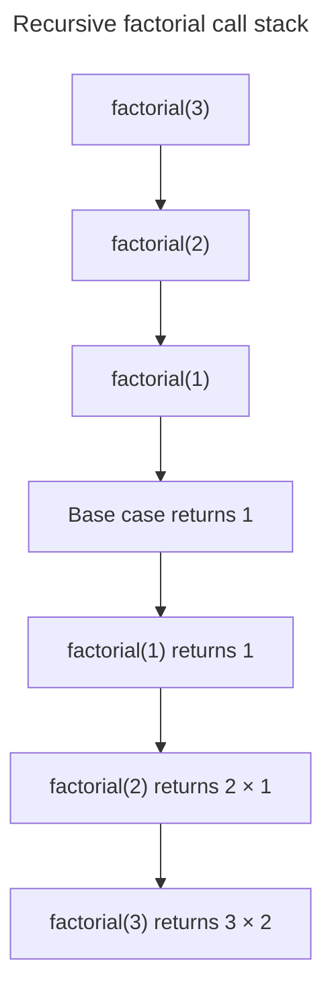

## TL;DR

Recursion solves a problem by calling the same function on smaller inputs until a base case is reached. It naturally fits recursive structures such as trees and divide-and-conquer algorithms, but each ordinary call consumes stack space. Validate that the input moves toward the base case, and use an explicit stack or loop when depth can be large or user-controlled.

```js live
function factorial(n) {
  if (!Number.isInteger(n) || n < 0) {
    throw new RangeError('n must be a non-negative integer');
  }
  if (n === 0) {
    return 1;
  }
  return n * factorial(n - 1);
}

console.log(factorial(4)); // Output: 24
```

---

## Recursive calls and returns

Each recursive call adds a stack frame until a base case stops the descent; results then return through the frames in reverse order.



A missing or unreachable base case keeps adding frames until the runtime throws a stack-overflow error.

## What is recursion and how is it used in JavaScript?

### Definition of recursion

Recursion is a technique in programming where a function calls itself in order to solve a problem. This approach is particularly useful for problems that can be divided into smaller, similar sub-problems. The key components of a recursive function are:

- **Base case**: The condition under which the function stops calling itself, preventing an infinite loop.
- **Recursive case**: The part of the function where it calls itself with a modified argument, moving towards the base case.

### Example: Calculating factorial

The factorial of a number `n` (denoted as `n!`) is the product of all positive integers less than or equal to `n`. It can be defined recursively as:

- `0! = 1` (base case)
- `n! = n * (n - 1)!` for `n > 0` (recursive case)

Here is how you can implement this in JavaScript:

```js live
function factorial(n) {
  if (!Number.isInteger(n) || n < 0) {
    throw new RangeError('n must be a non-negative integer');
  }
  if (n === 0) {
    // base case
    return 1;
  }
  return n * factorial(n - 1); // recursive case
}

console.log(factorial(4)); // Output: 24
```

### Example: Fibonacci sequence

The Fibonacci sequence is another classic example of recursion. Each number in the sequence is the sum of the two preceding ones, usually starting with 0 and 1. The sequence can be defined recursively as:

- `fib(0) = 0` (base case)
- `fib(1) = 1` (base case)
- `fib(n) = fib(n - 1) + fib(n - 2)` for `n > 1` (recursive case)

Here is how you can implement this in JavaScript:

```js live
function fibonacci(n) {
  if (n === 0) {
    // base case
    return 0;
  }
  if (n === 1) {
    // base case
    return 1;
  }
  return fibonacci(n - 1) + fibonacci(n - 2); // recursive case
}

console.log(fibonacci(6)); // Output: 8
```

### Tail recursion

Tail recursion is a form where the recursive call is the last operation. The ECMAScript specification defines proper tail calls in strict mode, but support is not consistent across widely used JavaScript engines. Do not rely on tail-call optimization to prevent stack overflow in portable application code.

```js live
function factorial(n, acc = 1) {
  if (n === 0) {
    return acc;
  }
  return factorial(n - 1, n * acc);
}

console.log(factorial(4)); // Output: 24
```

For unbounded depth, write the accumulator as a loop:

```js live
function factorialIterative(n) {
  let result = 1;
  for (let value = 2; value <= n; value += 1) {
    result *= value;
  }
  return result;
}
```

### Use cases for recursion

- **Tree traversal**: Recursion is often used to traverse tree structures, such as the DOM or binary trees.
- **Divide and conquer algorithms**: Algorithms like quicksort and mergesort use recursion to divide the problem into smaller sub-problems.
- **Dynamic programming**: Problems like the knapsack problem and certain graph algorithms can be solved using recursion.

The naive recursive Fibonacci example above performs repeated work and grows exponentially with `n`; it is useful for explaining recursion, not for production computation. Memoization or an iterative solution avoids recomputing the same subproblems.

## Further reading

- [MDN Web Docs: Recursion](https://developer.mozilla.org/en-US/docs/Glossary/Recursion)
- [JavaScript.info: Recursion and stack](https://javascript.info/recursion)
- [Eloquent JavaScript: Recursion](https://eloquentjavascript.net/03_functions.html#h_recursion)
