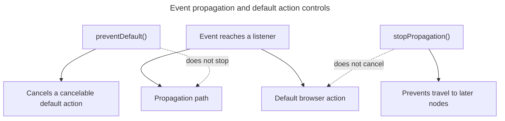

## TL;DR

`event.preventDefault()` cancels an event's default browser action when the event is cancelable, such as link navigation or form submission. `event.stopPropagation()` stops the event from continuing through the remaining capture and bubble path. It does not cancel the default action or stop other listeners on the same element; use `stopImmediatePropagation()` for the latter.

---

## Two independent effects

Event dispatch and the browser's default action are separate concerns, so stopping one does not automatically stop the other.



`stopImmediatePropagation()` additionally blocks later listeners on the current node; `preventDefault()` has an effect only when the event is cancelable.

## What is the difference between `event.preventDefault()` and `event.stopPropagation()`?

### `event.preventDefault()`

`event.preventDefault()` is a method that cancels the event if it is cancelable, meaning that the default action that belongs to the event will not occur. For example, this can be used to prevent a form from being submitted:

```js
document.querySelector('form').addEventListener('submit', function (event) {
  event.preventDefault();
  // Form submission is prevented
});
```

### `event.stopPropagation()`

`event.stopPropagation()` prevents the event from continuing through the DOM propagation path. In a bubble listener it prevents later ancestor listeners from seeing the event; in a capture listener it can prevent the event from reaching the target at all. It does not stop other listeners already registered on the current element.

```js
document.querySelector('.child').addEventListener('click', function (event) {
  event.stopPropagation();
  // Click event will not propagate to parent elements
});
```

### Key differences

- `event.preventDefault()` stops the default action associated with the event.
- `event.stopPropagation()` stops further capture or bubbling through the event path.
- `event.stopImmediatePropagation()` additionally stops later listeners on the current element.

### Use cases

- Use `event.preventDefault()` when you want to prevent the default behavior of an element, such as preventing a link from navigating or a form from submitting.
- Use `event.stopPropagation()` when you want to prevent an event from reaching parent elements, which can be useful in complex UIs where multiple elements have event listeners.

## Further reading

- [MDN Web Docs: event.preventDefault()](https://developer.mozilla.org/en-US/docs/Web/API/Event/preventDefault)
- [MDN Web Docs: event.stopPropagation()](https://developer.mozilla.org/en-US/docs/Web/API/Event/stopPropagation)
- [JavaScript Event Propagation](https://javascript.info/bubbling-and-capturing)
