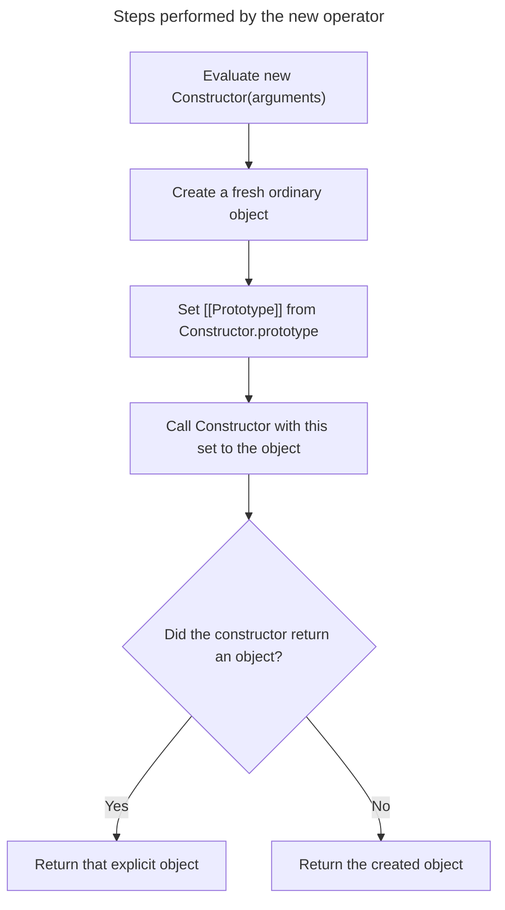

## TL;DR

Calling a constructable function with `new` creates a fresh object, links its prototype to the constructor's `prototype`, calls the constructor with `this` set to that object, and normally returns the object. If the constructor explicitly returns another non-primitive object, that returned object wins; an explicit primitive return is ignored. Arrow functions and some other callables are not constructable.

```js live
function Person(name) {
  this.name = name;
}

const person1 = new Person('Alice');
console.log(person1.name); // Alice
```

---

## Constructor invocation steps

`new` combines allocation, prototype linkage, invocation, and return selection into one operation.



A primitive explicit return is ignored, but an explicitly returned object replaces the newly allocated instance.

## The purpose of the `new` keyword

### Creating a new object

The `new` keyword is used to create a new instance of an object. When you call a constructor function with `new`, it creates a new object.

```js live
function Car(model) {
  this.model = model;
}

const myCar = new Car('Toyota');
console.log(myCar.model); // Toyota
```

### Setting the prototype

The new object’s internal `[[Prototype]]` property is set to the constructor function’s `prototype` property. This allows the new object to inherit properties and methods from the constructor’s prototype.

```js live
function Animal(type) {
  this.type = type;
}

Animal.prototype.speak = function () {
  console.log(`${this.type} makes a sound`);
};

const dog = new Animal('Dog');
dog.speak(); // Dog makes a sound
```

### Binding `this` to the new object

Inside the constructor function, `this` refers to the new object that is being created. This allows you to add properties and methods to the new object.

```js live
function Book(title) {
  this.title = title;
}

const myBook = new Book('JavaScript Essentials');
console.log(myBook.title); // JavaScript Essentials
```

### Returning the new object

The `new` keyword implicitly returns the new object created by the constructor function. If the constructor function explicitly returns an object, that object will be returned instead.

```js live
function Gadget(name) {
  this.name = name;
  return { type: 'Electronic' };
}

const myGadget = new Gadget('Smartphone');
console.log(myGadget.type); // Electronic
console.log(myGadget.name); // undefined
```

## Further reading

- [MDN Web Docs: new operator](https://developer.mozilla.org/en-US/docs/Web/JavaScript/Reference/Operators/new)
- [JavaScript.info: Constructor, operator "new"](https://javascript.info/constructor-new)
- [Eloquent JavaScript: Constructors](https://eloquentjavascript.net/06_object.html#h_XTmO7z7MPq)
